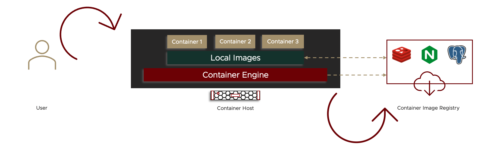
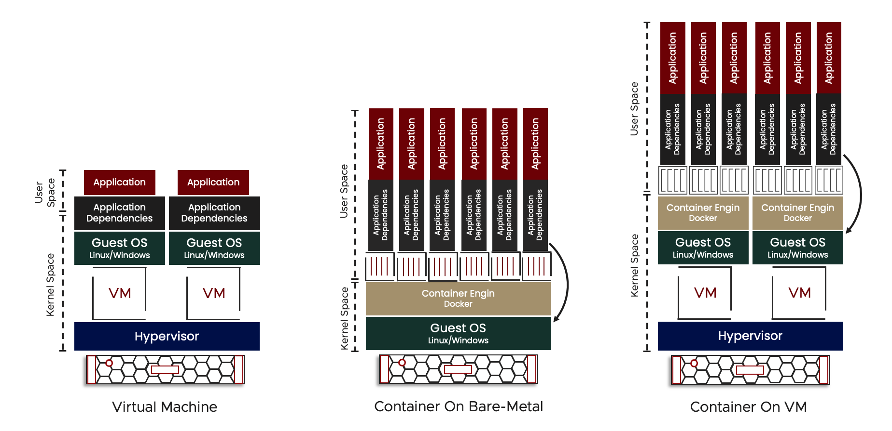
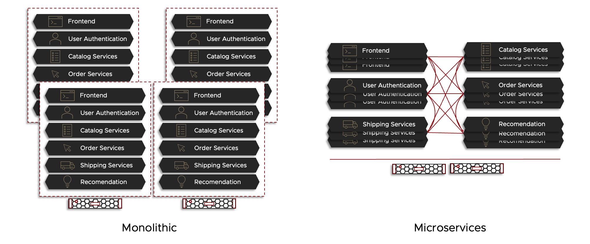

# Introduction to Kubernetes - Basic Concept

---

<p align="center">
    
</p>

---

---

> Section Intro

The concept of Modern Applications that is based on `Microservices`, `Cloud-Native`, and `DevOps` is no longer the new area, it is the current area now. Moving from a traditional `Monolithic Application` development into a `Microservices Application` development utilizing containers technology is becoming the norm and has been for a while. However, when the number of containers that are running and hosting your application grow in number to, let us say, 100's or 1000's or even more, managing and maintaining these container and your application is going to be road blocker. This is where `Kubernetes` comes in the picture. Kubernetes in a nutshell is an orchestration platform for your containerized application

---

# Containers & Microservices Quick Recap 

---

<p align="center">
    
</p>

---


## What is Container

---

Container is a very small and light-weight unit holding a pice of software with all the required dependencies for this software to run properly. A container runs on top of a compute resources (physical server or virtual machine) and operating system (linux and lately windows). A container is an isolated unit that have no knowledge of the underlying resources or other containers running on the same physical resource. 

> *Reference*
>
> *Referring to Docker documentation*
> - *A Container is a standard unit of software that packages up code and all its dependencies so the application runs quickly and reliably from one computing environment to another.*<sup>Reference [1](#References)</sup>

Tha basic idea of container came from utilizing several linux features allowing the isolation of the software package to run independently from others. Some of these linux features are [Namespace](https://en.wikipedia.org/wiki/Linux_namespaces), [CGroups](https://en.wikipedia.org/wiki/Cgroups), and [Union Filesystem](https://en.wikipedia.org/wiki/UnionFS)

- __Namespace__: [Process Isolation]: Namespaces are a feature of the Linux kernel that provide isolation for running processes, limiting their access to system resources without the running process being aware of the limitations. Namespace partitions kernel resources such that one set of processes sees one set of resources and another set of processes sees a different set of resources. Within the Linux kernel, there are different types of namespaces. Each namespace has its own unique properties:
  - User namespace: Dedicated set of user and group IDs. A process can have root privilege within its user namespace without having it in other user namespaces.
  - Process ID (PID) namespace assigns a set of PIDs to processes that are independent from the set of PIDs in other namespaces. 
  - Network namespace has an independent network stack: its own private routing table, set of IP addresses, socket listing, connection tracking table, firewall, and other network‑related resources.

- __CGroups__: [Resource Isolation]: A control group (cgroup) is a Linux kernel feature that limits, accounts for, and isolates the resource usage (CPU, memory, disk I/O, network, and so on) of a collection of processes. cgroups are used to control how much of a given key resource (CPU, memory, network, and disk I/O) can be accessed or used by a process or set of processes. 

- __Union Filesystem__: [Filesystem Isolation]: The union filesystem allows the files and directories of separate filesystem, known as layers, to be transparently overlaid to create a new virtual filesystem. While starting a container, container engine overlays all the layers attached to an image and creates a read-only filesystem. On top of that, container engine creates a read/write layer that is used by the container's runtime environment.

To be able to have a better understanding of containers, there are some components that needs to be understood.

- __Container__: A Container is a standardization of a unite that package both app code along with all the required dependencies for this code to run. 

- __Container Image__: A Container Image is a representation of the container and the software that runs within. A container image is a lightweight, standalone, executable package of software that includes everything needed to run an application: code, runtime, system tools, system libraries and settings. The Container Image is used by the container engine to create and run the container itself. 

- __Container Engine__: A Container engine is the engine that runs one or more isolated instance of container on the same operating system kernel on the same hardware (Container Host). Most modern container engines use the Open Container Initiative (OCI) container image format. A key component of a container engine is the container runtime, which communicates with the operating system kernel to perform the containerization process and configure access and security policies for running containers. Container Engine is also sometimes called Container Runtime. One of the most popular Container Runtime is called Containerd. 

- __Container Host__: A Container Host is simply the system that runs the containerized processes. A Container Host can be a physical bare-metal host or a virtual machine.

- __Container Isolation__: Container utilizes and takes advantages of several Linux operating system feature to provide the isolation required for each container running on the same Host. 3 main features to achieve this are Namespaces, Cgroups, and Union File System

- __Container Image Registry__: A Container Registry is one or more repository that is used to store Container Images. A Container platform/engine (such as Docker) pulls the images from the Container Registry to the Container Host to deploy the containers form the Image. Some of the popular container registries are DockerHub, Amazon ECR, Azure Container Registry, Google Container Registry. A Container Registry can be public or private.

---

<p align="center">
    
</p>

---

Most of the concepts explained for containers, technology have seen it before, especially when it comes to isolation as this is very similar to virtual machines. As a virtual machines perform isolation and virtualizing the underlying physical resource to be able to run multiple operating system and application in the form of a virtual machine, container also perform something similar, however container do not include a full operating system version running inside but rather it only contain a very light version with the required libraries and depend on the kernel of the underlying operating system. 

> *Reference*
>
> *Referring to Docker documentation*
> - *__Virtual machines__ (VMs) are an abstraction of physical hardware turning one server into many servers. The hypervisor allows multiple VMs to run on a single machine. Each VM includes a full copy of an operating system, the application, necessary binaries and libraries – taking up tens of GBs. VMs can also be slow to boot.*<sup>Reference [1](#References)</sup>
> - *__Containers__ are an abstraction at the app layer that packages code and dependencies together. Multiple containers can run on the same machine and share the OS kernel with other containers, each running as isolated processes in user space. Containers take up less space than VMs (container images are typically tens of MBs in size), can handle more applications and require fewer VMs and Operating systems.*<sup>Reference [1](#References)</sup>

When creating a virtual machine and a container, with virtual machine a hypervisor will be installed on the physical server and then create a virtual machine which will include a full copy of an operating system and the required applications. Container on the other-hand, an operating system (linux/Windows) will be installed on a physical server and then install the container requirements such as the container engine (such as docker or containerd) and then create the containers. The best approach is to run container on top of virtual machines

---

<p align="center">
    
</p>

---

## Container Benefits 

---

Containers provides several benefits in which increased container popularity in the modern application development.

> *Reference*
>
> *Referring to Kubernetes documentation*
>
> - *Container Benefits are:*<sup>Reference [5](#References)</sup>
>>  - *Agile application creation and deployment: increased ease and efficiency of container image creation compared to VM image use.*
>>  - *Continuous development, integration, and deployment: provides for reliable and frequent container image build and deployment with quick and efficient rollbacks (due to image immutability).*
>>  - *Dev and Ops separation of concerns: create application container images at build/release time rather than deployment time, thereby decoupling applications from infrastructure.*
>>  - *Observability: not only surfaces OS-level information and metrics, but also application health and other signals.*
>>  - *Environmental consistency across development, testing, and production: runs the same on a laptop as it does in the cloud.*
>>  - *Cloud and OS distribution portability: runs on Ubuntu, RHEL, CoreOS, on-premises, on major public clouds, and anywhere else.*
>>  - *Application-centric management: raises the level of abstraction from running an OS on virtual hardware to running an application on an OS using logical resources.*
>>  - *Loosely coupled, distributed, elastic, liberated micro-services: applications are broken into smaller, independent pieces and can be deployed and managed dynamically – not a monolithic stack running on one big single-purpose machine.*
>>  - *Resource isolation: predictable application performance.*
>>  - *Resource utilization: high efficiency and density.*

---

## What is Microservices

---

`Microservice Architecture` is a new (well not that new) method of developing application, it is more of an architectural approach to develop new modern application copping with the hype of Cloud-Native and DevOps path. Previously, the traditional application development way, called `Monolithic Architecture`, was based on coding and developing the full business application with all its services in a single object (physical server or a virtual machine). On the other hand, `Microservice Architecture` way is based on dividing the business application into a smaller services that are independent, loosely coupled, coded and developed on its own, and each one is serving a single business objective and running on a separate container as a micro-service, and all can integrate and communicate with each others using API or equivalent. 

> *Reference*
>
> *Referring to AWS documentation*
> - *With monolithic architectures, all processes are tightly coupled and run as a single service. This means that if one process of the application experiences a spike in demand, the entire architecture must be scaled. Adding or improving a monolithic application’s features becomes more complex as the code base grows. This complexity limits experimentation and makes it difficult to implement new ideas. Monolithic architectures add risk for application availability because many dependent and tightly coupled processes increase the impact of a single process failure.*<sup>Reference [3](#References)</sup>
> - *With a microservices architecture, an application is built as independent components that run each application process as a service. These services communicate via a well-defined interface using lightweight APIs. Services are built for business capabilities and each service performs a single function. Because they are independently run, each service can be updated, deployed, and scaled to meet demand for specific functions of an application.*<sup>Reference [3](#References)</sup>

To explain it more in a more simple way, let's take an example of an E-Commerce application. This type of application have several services such as (from a very high-level) a front-end service (to accept incoming requests and to present the products on the web interface), a user accounting and authentication service (to authenticate existing customer and hold data of this customer), a catalog service (to list the products and services provided by the application), an order service (to allow the customer to buy products and perform payment), a shipping service (to track the shipment of the product to the customer and provide info to the customer), and much more.

In a `Monolithic Architecture` all of these services are coded and run in a single object (virtual machine or a physical machine running linux or windows operating system). This means that, for example, in a black friday where customer are heavily accessing this E-Commerce application, the front-end and other services require more compute resources to handle the spike of requests, however, not all services are as heavily utilized as the front-end (for example advertisement service may not required additional compute resources). Even if some service do not require additional compute resources, in a `Monolithic Architecture`, service can not be separated and all service would need more compute resources such as more CPU, Memory or even more physical servers or virtual machines. 

Also, in a `Monolithic Architecture`, when a new service is to be added to the application, such as a recommendation services, as all the services are tightly coupled, the code check will not only run on the new service but on the full application code which will make the release-cycle 6-month or even more.

In a `Microservice Architecture`, Every service is lossy coupled and run in a separate container with no dependency on other services, so in the case of the utilization spike, only the front-end services (and other required services) will have another copy of it running in another container to handle the spike. Not all the services will be duplicated and this will reduce compute resources. 

Also, in the case of adding a new service, this service is developed in a separate container and will integrate with other services using API so code check and development is only for this new service not the full application making the release-cycle as short as couple of weeks or even less.

---

<p align="center">
    
</p>

---

---

# Kubernetes 

---

<p align="center">
    
</p>

---

## Kubernetes Basic Introduction - [Core Concept - What is Kubernetes]

---

Kubernetes is an open-source project build originally by Google in 2014 and later donated to [CNCF](https://www.cncf.io/) (Cloud Native Computing Foundation) designed to orchestrate, automate and manage containerized applications. The name Kubernetes originates from Greek, meaning helmsman or pilot. K8s as an abbreviation results from counting the eight letters between the "K" and the "s". The official description of kubernetes from the official kubernetes documentation is:

> *Reference*
>
> *Referring to Kubernetes documentation*
>
> - *Kubernetes is a portable, extensible, open source platform for managing containerized workloads and services, that facilitates both declarative configuration and automation. It has a large, rapidly growing ecosystem. Kubernetes services, support, and tools are widely available.*<sup>Reference [5](#References)</sup>

To have an understanding of what is kubernetes and why is it considered to be somehow a mandatory tool when it comes to cloud-native architecture and modern applications, let's look at the issue kubernetes is fixing and the additional capability it provides to container orchestration. 

When thinking about microservices, an application was divided into several microservices each running on a container which will result in a big number of running containers in the environment, and depending on the number of applications and how big they are, we may have 100's, 1,000's, or even more of running container. Now let's ask some of the main questions:
- How will those containers get deployed.
- What will happen if one or more containers failed in the deployment.
- What will happen if one or more container went down.
- How will the connection between all of these containers be.
- How can we scale an application
- How can we monitor the environment 

several question that if asked will find a big road blocker that will impact the implementation, operation and management of application running on top of containers. This is where kubernetes play a big role in it.

Kubernetes is an orchestration and automation tool for containers. Kubernetes is a cluster management open-source platform for managing and orchestrating containerized workload, application and services. Kubernetes is a clusters environment of a number of physical server or virtual machines (called nodes) where all the required software are installed to run containers and the components of kubernetes are also installed. once the Kubernetes is up and running, the user will have the ability to deploy containerized application through kubernetes and kubernetes will then provide a way to manage the lifecycle of containerized applications across an entire cluster. Kubernetes provide self-healing of failed containers, auto-scaling of container depending on required performance and resource utilization, ability to add plugins to add features to the kubernetes cluster such as the CNI (Container Networking Interface) plugin that provides networking and security capabilities as well as the ability to add other tools to the kubernetes environment adding further capabilities such as monitoring, reporting, load balancing, and much more.


> *Reference*
>
> *Referring to Kubernetes documentation*
>
> - *Containers are a good way to bundle and run your applications. In a production environment, you need to manage the containers that run the applications and ensure that there is no downtime. For example, if a container goes down, another container needs to start. Wouldn't it be easier if this behavior was handled by a system?*<sup>Reference [5](#References)</sup>
> - *That's how Kubernetes comes to the rescue! Kubernetes provides you with a framework to run distributed systems resiliently. It takes care of scaling and failover for your application, provides deployment patterns, and more. For example: Kubernetes can easily manage a canary deployment for your system.*<sup>Reference [5](#References)</sup>

---

<p align="center">
    
</p>

---

## Kubernetes Features & Benefits - [What Would Kubernetes WILL Provide]

---

- __Service discovery and load balancing__ Kubernetes can expose a container using the DNS name or using their own IP address. If traffic to a container is high, Kubernetes is able to load balance and distribute the network traffic so that the deployment is stable.
- __Storage orchestration__ Kubernetes allows you to automatically mount a storage system of your choice, such as local storages, public cloud providers, and more.
- __Automated rollout and rollbacks__ You can describe the desired state for your deployed containers using Kubernetes, and it can change the actual state to the desired state at a controlled rate. For example, you can automate Kubernetes to create new containers for your deployment, remove existing containers and adopt all their resources to the new container.
- __Automatic bin packing__ You provide Kubernetes with a cluster of nodes that it can use to run containerized tasks. You tell Kubernetes how much CPU and memory (RAM) each container needs. Kubernetes can fit containers onto your nodes to make the best use of your resources.
- __Self-healing__ Kubernetes restarts containers that fail, replaces containers, kills containers that don't respond to your user-defined health check, and doesn't advertise them to clients until they are ready to serve.
- __Secret and configuration management__ Kubernetes lets you store and manage sensitive information, such as passwords, OAuth tokens, and SSH keys. You can deploy and update secrets and application configuration without rebuilding your container images, and without exposing secrets in your stack configuration.
- __Batch execution__ In addition to services, Kubernetes can manage your batch and CI workloads, replacing containers that fail, if desired.
- __Horizontal scaling__ Scale your application up and down with a simple command, with a UI, or automatically based on CPU usage.
- __IPv4/IPv6 dual-stack__ Allocation of IPv4 and IPv6 addresses to Pods and Services
- __Designed for extensibility__ Add features to your Kubernetes cluster without changing upstream source code.

## Kubernetes Is Not An End-To-End Platform - [What Would Kubernetes WILL NOT Provide]

Kubernetes is not a complete end-to-end platform, it is more of an orchestration tool and cluster hosting containerized workload. Kubernetes concentrate on the container orchestration and thus can provide some feature from a platform solution perspective such as deployment, scaling, and load balancing. Kubernetes by itself will not provide logging or monitoring for example, and thus, kubernetes provide a option to add other solution and let these solutions integrates with the cluster environment to provide additional functionality such as logging, monitoring, and alerting solutions.

> *Reference*
>
> *Referring to Kubernetes documentation*
>
> - *Does not limit the types of applications supported. Kubernetes aims to support an extremely diverse variety of workloads, including stateless, stateful, and data-processing workloads. If an application can run in a container, it should run great on Kubernetes.*<sup>Reference [5](#References)</sup>
> - *Does not deploy source code and does not build your application. Continuous Integration, Delivery, and Deployment (CI/CD) workflows are determined by organization cultures and preferences as well as technical requirements.*<sup>Reference [5](#References)</sup>
> - *Does not provide application-level services, such as middleware (for example, message buses), data-processing frameworks (for example, Spark), databases (for example, MySQL), caches, nor cluster storage systems (for example, Ceph) as built-in services. Such components can run on Kubernetes, and/or can be accessed by applications running on Kubernetes through portable mechanisms, such as the Open Service Broker.*<sup>Reference [5](#References)</sup>
> - *Does not dictate logging, monitoring, or alerting solutions. It provides some integrations as proof of concept, and mechanisms to collect and export metrics.*<sup>Reference [5](#References)</sup>
> - *Does not provide nor mandate a configuration language/system (for example, Jsonnet). It provides a declarative API that may be targeted by arbitrary forms of declarative specifications.*<sup>Reference [5](#References)</sup>
> - *Does not provide nor adopt any comprehensive machine configuration, maintenance, management, or self-healing systems.*<sup>Reference [5](#References)</sup>
> - *Additionally, Kubernetes is not a mere orchestration system. In fact, it eliminates the need for orchestration. The technical definition of orchestration is execution of a defined workflow: first do A, then B, then C. In contrast, Kubernetes comprises a set of independent, composable control processes that continuously drive the current state towards the provided desired state. It shouldn't matter how you get from A to C. Centralized control is also not required. This results in a system that is easier to use and more powerful, robust, resilient, and extensible.*<sup>Reference [5](#References)</sup>

---

## How does Kubernetes Work

Kubernetes is a cluster having several physical servers or virtual machines (called nodes) running within them kubernetes components to achieve the desired output of kubernetes. Some of these some of these nodes will be called worker nodes and they are the nodes that will host the running containers hosting the applications. 

Nearly everything in kubernetes is seen as an object to kubernetes, a container is an object, a network is an object, and so on. A user defined an object and then kubernetes will create, deploy, manage, and maintain this object. When a user creates and object, a document defining this object type and its desired state is created and used by kubernetes. Normally this is done using a `YAML file` - JSON file can also be used but normally YAML files are most commonly used. YAML file are created and passed to kubernetes using the kubernetes API interface either by using the kubectl CLI command interface or directly to the API using a client library. 

This YAML file contains the type of the object (for example a container) and the desired state of this object (for example container networking). Kubernetes will then deploy the object explained in the YAML file and will continuously monitor this object and make sure that this object have the exact same state as described in the YAML file. So for example if the YAML file have an object type of a container with 2 networking interfaces, Kubernetes will always monitor the environment to make use this container is running and there as 2 networking interfaces connected to it. If this container died, the kubernetes will see that this is a mismatch with the desired state and will run another container with the same specs to maintain the desired state.

> *Reference*
>
> *Referring to Kubernetes documentation*
>
> - *A Kubernetes object is a `"record of intent"` --once you create the object, the Kubernetes system will constantly work to ensure that object exists. By creating an object, you're effectively telling the Kubernetes system what you want your cluster's workload to look like; this is your cluster's `desired state`.*<sup>Reference [5](#References)</sup>
> - *Almost every Kubernetes object includes two nested object fields that govern the object's configuration: the object spec and the object status. For objects that have a spec, you have to set this when you create the object, providing a description of the characteristics you want the resource to have: its `desired state`.*<sup>Reference [5](#References)</sup>
> - *The status describes the current state of the object, supplied and updated by the Kubernetes system and its components. The Kubernetes control plane continually and actively manages every object's `actual state` to match the `desired state` you supplied.*<sup>Reference [5](#References)</sup>
> - *When you create an object in Kubernetes, you must provide the object spec that describes its desired state, as well as some basic information about the object (such as a name). When you use the Kubernetes API to create the object (either directly or via kubectl), that API request must include that information as JSON in the request body. Most often, you provide the information to kubectl in file known as a `manifest`. By convention, manifests are YAML (you could also use JSON format). Tools such as kubectl convert the information from a manifest into JSON or another supported serialization format when making the API request over HTTP.*<sup>Reference [5](#References)</sup>

So as a summary, once the kubernetes cluster is created, the user starts creating object `manifest` in the form of a `YAML` file which it will hold the object `spec` and the object `desired state` and then pass it to kubernetes using the CLI kubectl or directly to the API. Kubernetes will make sure that this object is created based on the provided object spec and insure that the actual state of this object always match the defined desired state of this object.

Below is an example of a manifest in YAML formate the shows the required object spec for a kubernetes object called deployment.

---

```yaml
apiVersion: apps/v1 # API version number
kind: Deployment # Object type
metadata: # Additional info to be added to the object
  name: nginx-deployment # Name of the Object
spec: # Specs of the object
  replicas: 2 # Specify that 2 Pods to be deployed form the same replica
  spec: # Specs of the Container
    containers:
    - name: nginx # Container Name
      image: nginx:1.14.2 # Container Image
      ports: # Container Networking
      - containerPort: 80
```

---

> References:

- [[1] - Use containers to Build, Share and Run your applications](https://www.docker.com/resources/what-container/)
- [[2] - What Are Namespaces and cgroups, and How Do They Work](https://www.nginx.com/blog/what-are-namespaces-cgroups-how-do-they-work/)
- [[3] - What are Microservices](https://aws.amazon.com/microservices/)
- [[4] - What is Microservices Architecture](https://cloud.google.com/learn/what-is-microservices-architecture)
- [[5] - Kubernetes Overview](https://kubernetes.io/docs/concepts/overview/)
- [[6] - Objects In Kubernetes](https://kubernetes.io/docs/concepts/overview/working-with-objects/)

---

> Next Step:

[Kubernetes Architecture](/2.%20Kubernetes%20Architecture/)