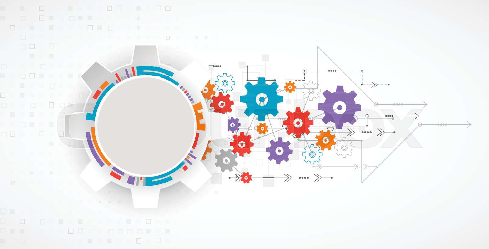

# Kubernetes Cluster Architecture & Components

Kubernetes is a cluster environment consist of several machine (called Nodes). This kubernetes cluster is known as a kubernetes architecture as this cluster have specific components and requirements. Each component is deployed in a specific way and perform a specific task.

---

    

---

# Kubernetes Architecture high-Level

Kubernetes is a clustered environment combined of one or more physical server or virtual machine called `nodes`. The kubernetes cluster is divided into 2 main parts. 

The `control plan`, is the part that manages and control the kubernetes cluster and all the objects deployed within. The control plan is built up of several components that run on top of one or more node of the kubernetes cluster. The control plane's components make global decisions about the cluster (for example, scheduling), as well as detecting and responding to cluster events. Control plane components can be run on any machine in the cluster (same or different machine). For design best practice, it is recommended to run them on dedicated machine. All nodes that are part of the control plan are called `Master Nodes`. 

On the other part of the kubernetes cluster is the `Worker Nodes`, the worker nodes are the nodes that hosts the containerized applications. So all containers will be running on top of the worker nodes and not the master nodes. 

The architecture of the kubernetes cluster can differ form one cluster to another depending on the usability of this cluster, however, any kubernetes cluster will have the control plan and the worker nodes. If a kubernetes cluster is used for production, it is advised to have at least 3 master nodes in the control plan and one or more worker nodes hosting the containerized application depending on the number of containers required and their resources. In a lab or a testing environment, only one master node is enough for the control plan. Also there is an option called [Minikube](https://minikube.sigs.k8s.io/docs/) which is a form of a kubernetes cluster deployed on top of macOS, Linux, or Windows machines and is by default contain only one node working as a master node and a worker node. This node will host the control plan components as well as the containerized application. The Minikube is only used for personal testing and not for production environment.

In a production environment, all containers run on the worker nodes that are total separated than the control plan components that run on the master nodes. Kubernetes itself provide the capability to run everything on only one node (working as master and worker node) which is not a recommended way of running kubernetes in your environment.

`Please Note: In kubernetes, the container runs inside of a kubernetes object called Pod. so whenever a Pod is referenced, it points to the container running inside of the Pod`

Referring to Kubernetes official documentation [_Referenced Below_], `Kubernetes Components:"`:

- A Kubernetes cluster consists of a set of worker machines, called nodes, that run containerized applications. Every cluster has at least one worker node.

- The worker node(s) host the Pods that are the components of the application workload. The control plane manages the worker nodes and the Pods in the cluster. In production environments, the control plane usually runs across multiple computers and a cluster usually runs multiple nodes, providing fault-tolerance and high availability.

---

## Kubernetes Main Components - (Control Plan & Worker Nodes Components)

---

> References:

- [Kubernetes Components](https://kubernetes.io/docs/concepts/overview/components/)
- [Kubernetes Architecture](https://kubernetes.io/docs/concepts/architecture/)
- [Kubernetes Overview - official Document](https://kubernetes.io/docs/concepts/overview/)
- [Communication between Nodes and the Control Plane](https://kubernetes.io/docs/concepts/architecture/control-plane-node-communication/)

---

> Next Step:

[Installing Kubernetes]()