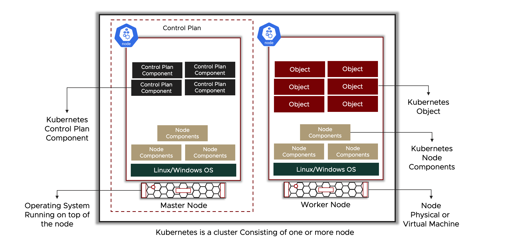
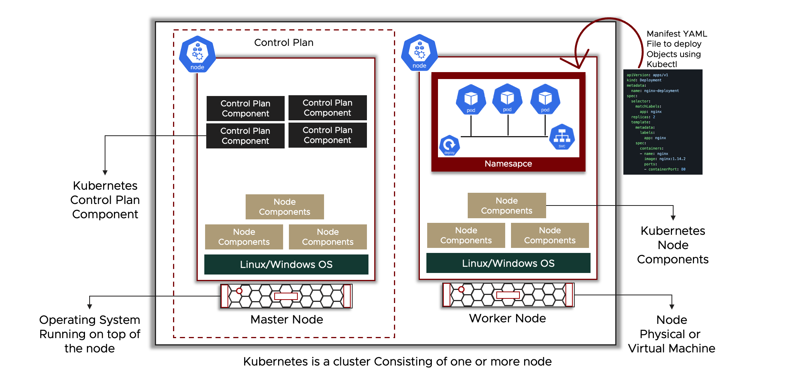
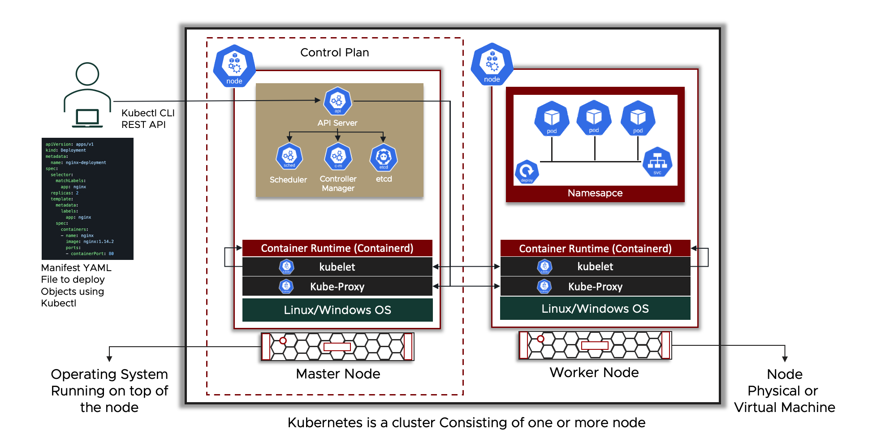
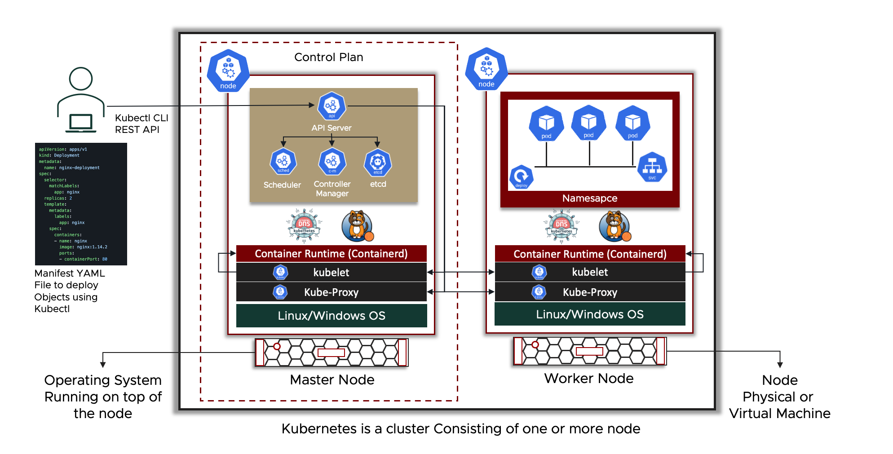

# Kubernetes Cluster Architecture - Components & High-level Main Objects

Kubernetes is a cluster environment consist of several machine (called Nodes). Kubernetes consist of objects (such as the nodes) and several components and the kubernetes cluster is designed and architected in a specific way. This kubernetes cluster is known as a kubernetes architecture as this cluster have specific components, objects, and requirements. Each component is deployed in a specific way and perform a specific task.

---

<p align="center">
    
</p>

---

## Kubernetes Architecture - High-Level

Kubernetes is a container orchestration platform, and with that being said, it points to the fact that kubernetes will have containers running on top of it as well as the fact that Kubernetes will provide orchestration, automation and further functionalities as explained in a previous [section](https://github.com/tahershaker/Learning-Kubernetes/tree/main/1.%20Introduction%20To%20Kubernetes#what-is-kubernetes---overview) such as Application deployment, Auto-Scaling, Self-Healing and much more. 

> Kubernetes Nodes

For containerized application to run on top of Kubernetes, compute resources (CPU & Memory) are required as well as several components providing the capability for running a container environment. Adding to this, for Kubernetes to be able to provide its added functionality (Application deployment, Auto-Scaling, Self-Healing, etc...), several more components are required to perform these functionality. The last, but not least, containerized applications requires some supporting function such as networking, security, monitoring, load balancing, DNS services, configuration management, and much more, thus, aside from the compute resources and components, several supporting tools, plugins, and 3rd party integrations are also required.

> Kubernetes Cluster

Kubernetes is a platform consisting of one or more compute resources called `Nodes` to provide the required compute resources to run containerized application. A kubernetes Node can be a physical server or virtual machine. These Nodes will be deployed in a `Cluster` form, and thus, Kubernetes is a `cluster` consisting of one or more node (physical server or virtual machine), hence, `Kubernetes Cluster` is always mentioned whenever kubernetes is discussed. Also, these Nodes will need an operating system, either Linux or Windows, to be installed. 

> Kubernetes Components

On top of the Kubernetes Nodes, several components will be deployed to support running a container environment as well as the kubernetes functionalities. These components in Kubernetes are divided into 2, `Control Plan` Components and `Node` Components. The Control Plan components will be responsible of Managing, Monitoring, Orchestrating and Automating kubernetes functionality, and on the other hand, the Node components are responsible for providing the capability of running the containers on top of the Node.

> Kubernetes Architecture

Kubernetes give the ability to deploy all components on only one Node, however, in a Kubernetes Architecture and best practices, these components will be separated. The Control Plan components will be deployed in the same Node(s), these Nodes will be called `Master Nodes`. The Master Nodes will not host any containerized Workload applications, only the control plan components. Containerized Workloads will run on a separate type of Nodes called `Worker Nodes`, these nodes will host all containers running the business applications. The Kubernetes Node Components will run on all Nodes in the cluster - Master and Worker Nodes - as these components provide the capability to run containers on top of the Nodes. Kubernetes follows a client-server type of architecture in a cluster form with 2 type of nodes within this cluster `Master` and `Worker`. In a kubernetes cluster, and based on the kubernetes architecture and best practices, at least one Master Node and one or more Worker Node are required. In a highly available kubernetes cluster architecture 3 Master Nodes are required.

> Kubernetes Objects

Nearly everything deployed in a Kubernetes Cluster is referred to as a `Kubernetes Object`. A node is considered as an Object, there are several object in Kubernetes and each one of them will have a different `Kind`; (a Node is an Object with the Kind Node). There are a container object, networking object, security object and for each supporting function there will be an object with a Kind that support it's function. 

> _Reference_
> - _A Kubernetes cluster consists of a set of worker machines, called nodes, that run containerized applications. Every cluster has at least one worker node._<sup>Reference [1](#References)</sup>
> - _The worker node(s) host the Pods that are the components of the application workload. The control plane manages the worker nodes and the Pods in the cluster. In production environments, the control plane usually runs across multiple computers and a cluster usually runs multiple nodes, providing fault-tolerance and high availability._<sup>Reference [1](#References)</sup>

To summarize:
- Kubernetes is a cluster consisting of one or more Node.
- There are 2 types of Nodes, `Master Node` and `Worker Node`.
- Several Components will be deployed on top of the Kubernetes cluster to achieve the required outcome.
- Components are divided into 2 types, `Control Plan` Components and `Node` Components
- Control Plan Components will be deployed on the Master Nodes, while Node Components will be deployed on all Nodes in the cluster.
- Based on Kubernetes Architecture and best practices, One Master Node and one or more Worker Nodes are required.
- In a highly available kubernetes cluster, 3 Master Nodes are required.
- Anything deployed in a Kubernetes Cluster to run Containerized workload application is considered a Kubernetes Object.
- Kubernetes Object have a `kind` which indicate the functionality of this Object.
- Node is a type of Object with the kind Node.

---

<p align="center">
    
</p>

---


## 2. Kubernetes Objects High-Level - Node, Namespace, Pods, Deployments & Services

Kubernetes includes several object to perform it's desired outcome and give the ability to users to deploy and build containerized applications. There are several objects in kubernetes and each have a specific function or usability to perform. Different Object have different `kind`, and based on the kind of the object, the functionality is different. for example, a node is an object with the kind node, a pod is an object with the kind pod, and each one of them have different functionality.

Some of the Kubernetes Object are listed below is a very high-level explanation and info.

### 2a. Kubernetes Node (high-level)

A Kubernetes `Node` is considered as the first basic mandatory object. A Kubernetes Node is a a physical server or virtual machine running linux or windows operating system along with other kubernetes components and is responsible to providing compute resources to run containerized application on tpo of it.

> _Reference_
> - _Kubernetes runs your workload by placing containers into Pods to run on Nodes. A node may be a virtual or physical machine, depending on the cluster. Each node is managed by the control plane and contains the services necessary to run Pods._<sup>Reference [3](#References)</sup>

---

### 2b. Kubernetes Namespace (high-level)

As explained, Kubernetes is a cluster and is used by several users and developer. To be able to isolate the interaction and the containerized workload running on top of the cluster for each user, developer, team, or group, Kubernetes uses the concept of `Namespace`. Namespace a logical concept and is responsible of isolating resources for each user, or group within a single kubernetes cluster. Any object that is created in a namespace will have no relation to another object created in a different namespace. Once the kubernetes cluster is deployed, there is a default namespace created by default and will hold any object created by default. Kubernetes Cluster admin can then create other namespaces and give access to these namespaces to different users and groups to be able to deploy containerized application while maintain the isolation between them.

> _Reference_
> - _In Kubernetes, namespaces provides a mechanism for isolating groups of resources within a single cluster. Names of resources need to be unique within a namespace, but not across namespaces. Namespace-based scoping is applicable only for namespaced objects (e.g. Deployments, Services, etc) and not for cluster-wide objects (e.g. StorageClass, Nodes, PersistentVolumes, etc)._<sup>Reference [4](#References)</sup>

---

### 2c. Kubernetes Pods (high-level)

A Kubernetes Pod is the smallest kubernetes object that can be created in a kubernetes cluster. In kubernetes, containers runs inside a Pod object and not directly on the kubernetes infrastructure. A Kubernetes Pod is a way to provide Kubernetes tha ability to deploy, manage and maintain the container running in the environment. A Pod can run one or more container indie of it and it provides the networking and the storage required by this container(s). When ever we are talking about a Pod in Kubernetes, it is most likely referring to the container running inside of this Pod.

> _Reference_
> - _Pods are the smallest deployable units of computing that you can create and manage in Kubernetes._<sup>Reference [5](#References)</sup>
> - _A Pod (as in a pod of whales or pea pod) is a group of one or more containers, with shared storage and network resources, and a specification for how to run the containers. A Pod's contents are always co-located and co-scheduled, and run in a shared context. A Pod models an application-specific "logical host": it contains one or more application containers which are relatively tightly coupled._<sup>Reference [5](#References)</sup> 

---

### 2d. Kubernetes Deployment (high-level)

A containerized application may (in most cases) consists of several containers connected together in a specific way and are tightly dependant on each other. The containers of this application will run in separate Pods inside Kubernetes. A deployment is a kubernetes object that deploy the application as one bucket with all the Pods required to run this application. A deployment will give the user the ability to create the full application specification and desired state all in one go. In the YAML file used to deploy the Deployment Object, the user can specify the number of pods required (which is described in an object called ReplicaSet), which image to be used, the networking of each pod, and much more. With the Deployment, a user can update the full application using the YAML file used to deploy this Deployment.

> _Reference_
> - _A Deployment provides declarative updates for Pods and ReplicaSets._<sup>Reference [6](#References)</sup>
> - _You describe a desired state in a Deployment, and the Deployment Controller changes the actual state to the desired state at a controlled rate. You can define Deployments to create new ReplicaSets, or to remove existing Deployments and adopt all their resources with new Deployments._<sup>Reference [6](#References)</sup>

---

### 2e. Kubernetes Services (high-level)

For a containerized application to work, some microservices that are running inside a Pod would need to communicate with each other or users need to reach this application. Services are a Kubernetes object handling the networking of the application running in the kubernetes cluster. The service is an abstraction that expose the application running inside a Pod. Each service have it's own IP address and this is the one used to reach the Pods. The kubernetes service also provide a service discovery functionality to the Pods running in the environment, As containers or Pod are ephemeral, they may die and another one is created with a different IP. Service takes care of this issue and serve the traffic to whatever container or Pod that is attached to it regardless of the Pod IP. The service do serve networking for a set of Pods attached to this service. There are different type of services which are going to be explained in details in a later section.

> _Reference_
> - _In Kubernetes, a Service is a method for exposing a network application that is running as one or more Pods in your cluster._<sup>Reference [7](#References)</sup>
> - _The Service API, part of Kubernetes, is an abstraction to help you expose groups of Pods over a network. Each Service object defines a logical set of endpoints (usually these endpoints are Pods) along with a policy about how to make those pods accessible._<sup>Reference [7](#References)</sup>
> - _A key aim of Services in Kubernetes is that you don't need to modify your existing application to use an unfamiliar service discovery mechanism. You can run code in Pods, whether this is a code designed for a cloud-native world, or an older app you've containerized. You use a Service to make that set of Pods available on the network so that clients can interact with it._<sup>Reference [7](#References)</sup>

---

### 2f. How can an Object be Created or Deployed - YAML Manifest File

When interacting with a Kubernetes cluster, the user uses a CLI tool called kubectl (which will be discussed in more details in a later section) or directly using API requests. To create an object in Kubernetes, the user must define the kind, specs, and desired state of this object. As an example, if a user wants to deploy a Pod, then the user my specify that this kind of this object is a Pod with the specification of the Pod such as the container image and other configuration of the Pod and then the desired state of this Pod such as having 2 replicas of this Pod.

All of this information are defined in a manifest file. Normally this is done using a `YAML` formate file - `PS: JSON file can also be used but normally YAML files are most commonly used`. The user create the YAML file and defined all of these information inside this file and then send it to the kubernetes cluster using kubectl CLI or an API request with this file attached to it. 

Once the Manifest YAML file is sent to the kubernetes cluster, kubernetes will work on creating, Deploying, monitoring, and maintaining this object on the kubernetes cluster.

> _Reference_
> - _A Kubernetes object is a `"record of intent"` --once you create the object, the Kubernetes system will constantly work to ensure that object exists. By creating an object, you're effectively telling the Kubernetes system what you want your cluster's workload to look like; this is your cluster's `desired state`._<sup>Reference [2](#References)</sup>
> - _Almost every Kubernetes object includes two nested object fields that govern the object's configuration: the object spec and the object status. For objects that have a spec, you have to set this when you create the object, providing a description of the characteristics you want the resource to have: its `desired state`._<sup>Reference [2](#References)</sup>
> - _The status describes the current state of the object, supplied and updated by the Kubernetes system and its components. The Kubernetes control plane continually and actively manages every object's `actual state` to match the `desired state` you supplied._<sup>Reference [2](#References)</sup>
> - _When you create an object in Kubernetes, you must provide the object spec that describes its desired state, as well as some basic information about the object (such as a name). When you use the Kubernetes API to create the object (either directly or via kubectl), that API request must include that information as JSON in the request body. Most often, you provide the information to kubectl in file known as a `manifest`. By convention, manifests are YAML (you could also use JSON format). Tools such as kubectl convert the information from a manifest into JSON or another supported serialization format when making the API request over HTTP._<sup>Reference [2](#References)</sup>

As a summary, once the kubernetes cluster is created, the user starts creating object `manifest` in the form of a `YAML` file which it will hold the object `spec` and the object `desired state` and then pass it to kubernetes using the CLI kubectl tool or directly using an API request. Kubernetes will make sure that this object is created based on the provided object spec and insure that the actual state of this object always match the defined desired state of this object.

Below is an example of a manifest in YAML format the shows the required object spec for a kubernetes object called deployment.

---

```yaml
apiVersion: apps/v1 # version number of the API
kind: Deployment # Kubernetes object type
metadata:
  name: nginx-deployment
spec: # Specs of the object
  selector:
    matchLabels:
      app: nginx
  replicas: 2 # tells deployment to run 2 pods matching the template
  template:
    metadata:
      labels:
        app: nginx
    spec:
      containers:
      - name: nginx
        image: nginx:1.14.2
        ports:
        - containerPort: 80
```

---

<p align="center">
    
</p>

---

## 3. Kubernetes Components - (Control Plan & Nodes Components)

Kubernetes is based on several components to provide it's desired outcomes, and each component have a specific task to perform. When talking about Kubernetes Components, 2 types of components will be discussed. `Control Plan` components and `Node` component. The Control Plan components are responsible for managing and maintaining the kubernetes cluster and the objects deployed within. The Control Plan components will be deployed on specific nodes and not all nodes in the kubernetes cluster. The nodes that will have the Control Plan components running on with be called `Master Nodes` and all other nodes will be called `Worker Nodes`. The Node components are responsible of the life-cycle and networking of the Pod running within the kubernetes cluster. The Node components will be deployed on every node in the kubernetes cluster.

---

### 3a. Control Plan Components

`The control plane components is responsible for container orchestration and maintaining the desired state of the cluster.`

The Control Plan components are responsible for interacting with the kubernetes cluster, monitoring and maintaining kubernetes cluster objects desired state and taking global actions when required to ensure desired state is met. By default, there are 4 main components in the control plan. In some situation, additional control plan component may exists, for example, if the kubernetes cluster deployed on a cloud provider (such as AWS, GCP, Azure or even VMware vSphere), there will be another 5th component that may be deployed to interact with the cloud provider.

The Control Plan component may be deployed on any node in the kubernetes cluster, however, for architecture consistency, control plan components are deployed on one or three (in a highly available cluster) nodes and these nodes are called `Master Nodes`. When using scripts or deployment tools to deploy a Kubernetes Cluster (which is the majority of the cases), these scripts will install and deploy all control plan components on one or three nodes. 

The 4 main Control Plan components are API Server, Controller Manager, Scheduler, and etcd. 

> _Reference_
> - _The control plane's components make global decisions about the cluster (for example, scheduling), as well as detecting and responding to cluster events (for example, starting up a new pod when a deployment's replicas field is unsatisfied)._<sup>Reference [9](#References)</sup>
> - _Control plane components can be run on any machine in the cluster. However, for simplicity, set up scripts typically start all control plane components on the same machine, and do not run user containers on this machine._<sup>Reference [9](#References)</sup>

---

#### 3a-[i]. API Server

`The API server expose the kubernetes cluster API and serve as the front-end of the kubernetes cluster making it the central hub of all communication.`

The API Server component is responsible for communication and user interaction with the kubernetes cluster. Any request sent to a kubernetes cluster to perform any action will be sent to the API server component. The API Server component is also responsible for the internal components communication as well as the communication between the Control Plan and Kubernetes Node. If a 3rd part solution, plugin, or application is added to and integrated with the kubernetes cluster, communication will also direct to the API Server. 

User interaction with a kubernetes cluster is done using a CLI tool called `kubectl` or directly through API requests with the destination IP to be the API server IP. The user can use the kubectl or API to retrieve info from the kubernetes cluster or to create objects using the manifest YAML file.

The communication between the user using the kubectl to the API server is done through HTTPS REST APIs, however, the internal communication between different components and the API server is done using [gRPC](https://grpc.io/docs/what-is-grpc/introduction/). Over TLS for more security.  

In summary - API Server is responsible for:
- Exposing the Cluster API and handles all API requests
- Authentication and Authorization
- Processing API requests and validating data for the API objects like pods, services, etc. 
- Internal components communication
- Communication between the Control Plan and the Node Components

To learn more about the Kubernetes API into a more deep details such as specifications and versions, please refer to this [link](https://kubernetes.io/docs/concepts/overview/kubernetes-api/)

> _Reference_
> - _The API server is a component of the Kubernetes control plane that exposes the Kubernetes API. The API server is the front end for the Kubernetes control plane._<sup>Reference [10](#References)</sup>
> - _The main implementation of a Kubernetes API server is [kube-apiserver](https://kubernetes.io/docs/reference/generated/kube-apiserver/). kube-apiserver is designed to scale horizontally—that is, it scales by deploying more instances. You can run several instances of kube-apiserver and balance traffic between those instances._<sup>Reference [10](#References)</sup>

---

#### 3a-[ii]. Controller Manager

`The Controller Manager is responsible for running multiple controllers that maintain the desired state of the cluster.`

The Controller Manager component is built out of several controllers all deployed and packaged in the Controller Manager component. The main responsibility of these controller is to maintain the desired state of the kubernetes cluster and all the objects deploy within. Controllers are programs that runs in a continuous loop and watches the current state of objects and make sure it matches the desired state the this object was created with. If the actual state and the desired state of an object does not match, controllers send requests to other components or take actions to make sure the desired state of this object is met. 

If a Deployment is created, using the manifest YAML file which includes the specs of this deployment and the desired state of it (for example 3 replicas of the Pod), one of the controllers in the Controller Manager components (called Deployment Controller) will monitor the Deployment (for ex the Pods), and ensure that this Deployment current state is the same as the desired state described in the manifest YAML file. For example, if a Pod died, the controller will get notified and will take action (utilizing other control plan components) to create a new Pod with the same specs as the one died to ensure the desired state is met.

Each controller instance is responsible of a specific object/resource/task. Kubernetes objects (pods, namespaces, jobs, replicaSet, etc...) are managed by respective controllers. Controller manager is a component that manages all the Kubernetes controllers.

 Several controller are built in the controller-manager by default, more additional custom made controllers can be installed in addition to the existing ones, the additional controller as sometimes called `Operators`.

Examples of the built in controllers are:
- __Node Controller__: Responsible for managing Worker Nodes. It will monitor Nodes connecting to the cluster, validate the Node's health status, and update the Node's status field.
- __Deployment Controller__: Responsible for managing Deployment objects and creating/modifying ReplicaSet objects.
- __ReplicaSet Controller__: Responsible for creating/modifying Pods based on the ReplicaSet object configuration.
- __Service Controller__: Responsible for configuring ClusterIP, NodePort, and LoadBalancer configuration based on Service objects.

> _Reference_
> - _kube-controller-manager: - Control plane component that runs controller processes._<sup>Reference [12](#References)</sup>
> - _Logically, each controller is a separate process, but to reduce complexity, they are all compiled into a single binary and run in a single process._<sup>Reference [12](#References)</sup>
> - _In Kubernetes, controllers are control loops that watch the state of your cluster, then make or request changes where needed. Each controller tries to move the current cluster state closer to the desired state._<sup>Reference [10](#References)</sup>
> - _There are many different types of controllers. Some examples of them are:_<sup>Reference [12](#References)</sup>
>>  - *__Node controller__: Responsible for noticing and responding when nodes go down.*
>>  - *__Job controller__: Watches for Job objects that represent one-off tasks, then creates Pods to run those tasks to completion.*
>>  - *__EndpointSlice controller__: Populates EndpointSlice objects (to provide a link between Services and Pods).*
>>  - *__ServiceAccount controller__: Create default ServiceAccounts for new namespaces.*
>>>    *- The above is not an exhaustive list.*

---

#### 3a-[iii]. Scheduler

`The Scheduler is responsible for scheduling Kubernetes pods on Worker Nodes by finding a suitable Worker Node to run newly created Pod(s).`

Wether creating a Deployment, ReplicaSet, or a Pod, when a request to deploy a new Pod is received through the manifest YAML file, this file holds the Pod requirements such as the CPU, Memory, Networking, Storage, Affinity and much more. The scheduler is responsible to identify a suitable Worker Node to run this Pod on which satisfy all requirements of that Pod. The criteria that the scheduler use to chose the suitable node will not only be based on the required resources of the Pod but also will include additional criteria (if applicable) such as policies and affinity rules along with more criteria. 

The Scheduler is a controller that is managed by the Controller Manager and listens to pod creation events in the API server. The scheduler has two phases; `Scheduling cycle` (responsible for selecting a Worker Node) and the `Binding cycle` (Binds the selected Node to the newly created Pod and applies that change to the cluster). 

For the scheduler to choose the best node, it uses `filtering` and `scoring` operations. The scheduler filters that available nodes in the cluster and then apply a scoring to the filtered node to chose the best suitable node. In filtering, the scheduler finds the best-suited nodes where the pod can be scheduled. For example, if there are five worker nodes with resource availability to run the pod, it selects all five nodes. If there are no nodes, then the pod is unschedulable and moved to the scheduling queue. In the scoring phase, the scheduler ranks the nodes by assigning a score to the filtered worker nodes. The scheduler makes the scoring by calling multiple scheduling plugins. Finally, the worker node with the highest rank will be selected for scheduling the pod. If all the nodes have the same rank, a node will be selected at random.

Pod have priorities, thus, the scheduler always places the high-priority pods ahead of the low-priority pods for scheduling. Also, in some cases, after the pod starts running in the selected node, the pod might get evicted or moved to other nodes. 

Custom schedulers can be created and multiple schedulers can run in a cluster along with the default scheduler controller. When a pod is deployed, custom scheduler can be specified in the pod manifest and the scheduling decisions will be taken based on the custom scheduler logic not the default scheduler controller.

> _Reference_
> - _Control plane component that watches for newly created Pods with no assigned node, and selects a node for them to run on._<sup>Reference [13](#References)</sup>
> - _Factors taken into account for scheduling decisions include: individual and collective resource requirements, hardware/software/policy constraints, affinity and anti-affinity specifications, data locality, inter-workload interference, and deadlines._<sup>Reference [13](#References)</sup>

---

#### 3a-[iv]. etcd

`etcd is considered to be the database of the kubernetes cluster which it will store all data of the cluster in a key-value store.`

When creating a kubernetes cluster and objects within this cluster, all the data of the cluster and the objects must be stored somewhere. The etcd acts as the database of the kubernetes cluster and store the cluster configuration along with all data of all objects in a key-value store. etcd is an open-source strongly consistent, distributed key-value store that is used by kubernetes as well as it is used by other projects. 

etcd stores all configurations, states, and metadata of Kubernetes objects (pods, deployments, etc...) under the /registry directory key in key-value format. For example, information on a pod named Nginx in the default namespace can be found under /registry/pods/default/nginx.

etcd characteristics can be defined as:
- __Key Value Store:__ A nonrelational database that stores data as keys and values. It also exposes a key-value API. The datastore is built on top of BboltDB which is a fork of BoltDB.
- __Distributed:__ etcd is designed to run on multiple nodes as a cluster without sacrificing consistency.
- __Strongly consistent:__ If an update is made to a node, strong consistency will ensure it gets updated to all the other nodes in the cluster immediately.

> _Reference_
> - _Consistent and highly-available key value store used as Kubernetes' backing store for all cluster data._<sup>Reference [14](#References)</sup>
> - _If your Kubernetes cluster uses etcd as its backing store, make sure you have a back up plan for the data._<sup>Reference [14](#References)</sup>

> _Reference_
> - _etcd is a strongly consistent, distributed key-value store that provides a reliable way to store data that needs to be accessed by a distributed system or cluster of machines._<sup>Reference [15](#References)</sup>

---

### 3b. Node Components

`The Nodes components are responsible for running containerized applications. `

The Node Components is responsible of deploying, monitoring and maintaining the Pods running on the node, Provides Pod Networking connectivity and provide reporting about the Pod status to the control plan. The Node components will be running on all the nodes in the cluster Master Nodes or Worker Nodes. 

---

#### 3b-[i]. Kubelet 

`Kubelet is an agent running on each node responsible of running the containers inside Pods.`

The kubelet is an agent component running on every node in the cluster (Master and Worker Nodes). kubelet does not run as a container instead runs as a daemon, managed by systemd on each node. kubelet is responsible for registering Nodes with the API server (so kubernetes can keep track of the nodes) and building the containers inside Pods and monitor their status making sure that the container are in a healthy state. The state of containers are reported back to the control plan. If any container failed, it is the responsibility of the kubelet to report the status and redeploy the container and Pod if required.

Kubelet is responsible of the following:
- Creating, modifying, and deleting containers for the pod.
- Responsible for handling liveliness, readiness, and startup probes.
- Responsible for Mounting volumes by reading pod configuration and creating respective directories on the host for the volume mount.
- Collecting and reporting Node and pod status via calls to the API server with implementations like cAdvisor and CRI.

Kubelet is also a controller that watches for pod changes and utilizes the node’s container runtime to pull images, run containers, etc.

Couple of additional points regarding kubelet:
- Kubelet uses the CRI (container runtime interface) gRPC interface to talk to the container runtime. 
- It also exposes an HTTP endpoint to stream logs and provides exec sessions for clients.
- Uses the CSI (container storage interface) gRPC to configure block volumes.
- It uses the CNI plugin configured in the cluster to allocate the pod IP address and set up any necessary network routes and firewall rules for the pod.

In a later section, communication architecture between the control plan and the kubelet will be discussed in more details.

> _Reference_
> - _An agent that runs on each node in the cluster. It makes sure that containers are running in a Pod._<sup>Reference [17](#References)</sup>
> - _The kubelet takes a set of PodSpecs that are provided through various mechanisms and ensures that the containers described in those PodSpecs are running and healthy. The kubelet doesn't manage containers which were not created by Kubernetes._<sup>Reference [17](#References)</sup>

---

#### 3b-[ii]. Kube-Proxy

`Kube-Proxy is an instance or a process running on each node and is responsible of the basic networking for Pods.`

Kube-Proxy is an agent running on every node in the cluster (Master and Worker Nodes) and is responsible for a part of the Pod networking taking place in the kubernetes cluster. In kubernetes, the networking of a Pod is defined as a kubernetes object called `service` The kube-Proxy is not responsible for the full end-to-end networking but rather it monitors for the services created for Pod networking and translate them into networking rule in the linux kernel to forward traffic. 

Kube-Proxy can run in the kubernetes cluster as a DaemonSet or as a process running directly on the linux kernel, this depend on how you setup the kubernetes cluster.

When kubernetes service are explained, more info about kube-proxy will be shared. However, from a high-level, The services will have an IP range and it will receive traffic going to a Pod in the back-end of the service. The Pod in the back-end will have another IP range, the Kube-Proxy will perform NATing from the Service to the Pod networking. These NAT rules are simply mappings of Service IP to Pod IP. When a request is sent to a Service, it is redirected to a backend Pod based on these rules.

> _Reference_
> - _kube-proxy is a network proxy that runs on each node in your cluster, implementing part of the Kubernetes Service concept._<sup>Reference [18](#References)</sup>
> - _kube-proxy maintains network rules on nodes. These network rules allow network communication to your Pods from network sessions inside or outside of your cluster._<sup>Reference [18](#References)</sup>
> - _kube-proxy uses the operating system packet filtering layer if there is one and it's available. Otherwise, kube-proxy forwards the traffic itself._<sup>Reference [18](#References)</sup>

---

#### 3b-[iii]. Container Runtime

`Container Runtime is part of the Container Engine and is responsible for the containerization process and running container on the nodes.`

A Container engine is the engine that runs one or more isolated instance of container on the same operating system kernel on the same hardware (Container Host). Most modern container engines use the Open Container Initiative (OCI) container image format. A key component of a container engine is the container runtime, which communicates with the operating system kernel to perform the containerization process and configure access and security policies for running containers. Container Engine is also sometimes called Container Runtime. One of the most popular Container Runtime is called Containerd. 

> _Reference_
> - _A fundamental component that empowers Kubernetes to run containers effectively. It is responsible for managing the execution and lifecycle of containers within the Kubernetes environment._<sup>Reference [19](#References)</sup>
> - _Kubernetes supports container runtime such as containerd, CRI-O, and any other implementation of the Kubernetes CRI (Container Runtime Interface)._<sup>Reference [19](#References)</sup>

---

<p align="center">
    
</p>

---


## 4. Additional Kubernetes Components

In a Kubernetes Cluster, there can be some additional components and in most use cases there will be additional components installed on the kubernetes cluster. for a list of Addons and to install them, please refer to this [link](https://kubernetes.io/docs/concepts/cluster-administration/addons/). Also referenced below.

Maybe most of the Addons are not strictly required, some are a must or should have. Some of the important Addons are:

---

### 4a. DNS

For any Kubernetes cluster, DNS service is very important and all kubernetes cluster should have DNS service running as Kubernetes creates DNS records for Services and Pods. a very common implementation of DNS service in a Kubernetes Cluster is `CoreDNS`. Depending on how the kubernetes cluster is deployed, cluster DNS may be installed by default as we will see in a later section.

> _Reference_
> - _While the other addons are not strictly required, all Kubernetes clusters should have cluster DNS, as many examples rely on it._<sup>Reference [22](#References)</sup>
> - _Cluster DNS is a DNS server, in addition to the other DNS server(s) in your environment, which serves DNS records for Kubernetes services._<sup>Reference [22](#References)</sup>
> - _Containers started by Kubernetes automatically include this DNS server in their DNS searches._<sup>Reference [22](#References)</sup>

---

### 4b. Network Plugins

By default Kubernetes do not provide extensive networking features for the cluster and almost depend on a network plugin (also called Container Networking Interface - CNI - ) to perform this action. Kubernetes have defined a framework for how the network plugin should behave and specified it in container network interface (CNI) specification. The main responsibility of the CNI is to provide IP addresses to the Pod and allow communication between them based on the CNI specifications. Some of the most widely used CNIs are [Calico](https://www.tigera.io/project-calico/), [Flannel](https://github.com/flannel-io/flannel#deploying-flannel-manually), and [Cilium](https://github.com/cilium/cilium).

> _Reference_
> - _Network plugins are software components that implement the container network interface (CNI) specification. They are responsible for allocating IP addresses to pods and enabling them to communicate with each other within the cluster._<sup>Reference [23](#References)</sup>

---

<p align="center">
    
</p>

---


<p align="center">
    
</p>

---


#### References

- [[1] - Kubernetes Architecture](https://kubernetes.io/docs/concepts/architecture/)
- [[2] - Kubernetes Objects](https://kubernetes.io/docs/concepts/overview/working-with-objects/)
- [[3] - kubernetes Nodes](https://kubernetes.io/docs/concepts/architecture/nodes/)
- [[4] - Kubernetes Namespaces](https://kubernetes.io/docs/concepts/overview/working-with-objects/namespaces/)
- [[5] - Kubernetes Pod](https://kubernetes.io/docs/concepts/workloads/pods/)
- [[6] - Kubernetes Deployment](https://kubernetes.io/docs/concepts/workloads/controllers/deployment/)
- [[7] - Kubernetes Services](https://kubernetes.io/docs/concepts/services-networking/service/)
- [[8] - Kubernetes Components](https://kubernetes.io/docs/concepts/overview/components/)
- [[9] - Kubernetes Control Plan Components](https://kubernetes.io/docs/concepts/overview/components/#control-plane-components)
- [[] - Kubernetes Controllers](https://kubernetes.io/docs/concepts/architecture/controller/)
- [[10] - Kubernetes Kube-ApiServer](https://kubernetes.io/docs/concepts/overview/components/#kube-apiserver)
- [[11] - The Kubernetes API](https://kubernetes.io/docs/concepts/overview/kubernetes-api/)
- [[12] - Kubernetes Controller Manager](https://kubernetes.io/docs/concepts/overview/components/#kube-controller-manager)
- [[13] - Kubernetes Scheduler](https://kubernetes.io/docs/concepts/overview/components/#kube-scheduler)
- [[14] - Kubernetes etcd](https://kubernetes.io/docs/concepts/overview/components/#etcd)
- [[15] - etcd - Official Website](https://etcd.io/)
- [[16] - Kubernetes Node Components](https://kubernetes.io/docs/concepts/overview/components/#node-components)
- [[17] - Kubernetes Kubelet](https://kubernetes.io/docs/concepts/overview/components/#kubelet)
- [[18] - Kubernetes Kube-Proxy](https://kubernetes.io/docs/concepts/overview/components/#kube-proxy)
- [[19] - Kubernetes Container Runtime](https://kubernetes.io/docs/concepts/overview/components/#container-runtime)
- [[20] - Kubernetes Addons](https://kubernetes.io/docs/concepts/overview/components/#addons)
- [[21] - Installing Kubernetes Addons](https://kubernetes.io/docs/concepts/cluster-administration/addons/)
- [[22] - Kubernetes DNS](https://kubernetes.io/docs/concepts/overview/components/#dns)
- [[23] - Kubernetes Network Plugin](https://kubernetes.io/docs/concepts/overview/components/#network-plugins)
- [[24] - Kubernetes High Availability Topology](https://kubernetes.io/docs/setup/production-environment/tools/kubeadm/ha-topology/)

---

> Next Step:

[Kubernetes Objects]()