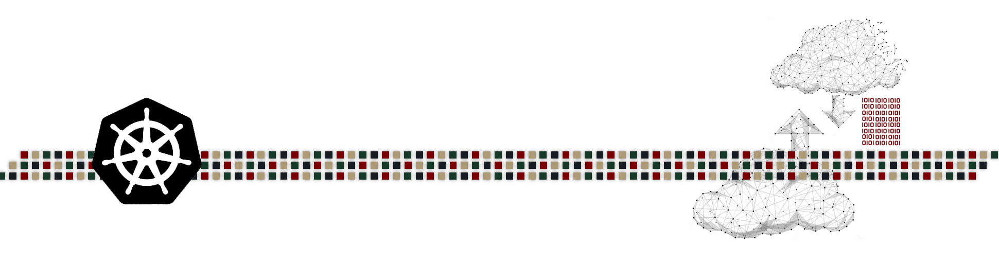

# Kubernetes Cluster Architecture - Components & High-level Main Objects

Kubernetes is a cluster environment consist of several machine (called Nodes). Kubernetes consist of objects (such as the nodes) and several components and the kubernetes cluster is designed and architected in a specific way. This kubernetes cluster is known as a kubernetes architecture as this cluster have specific components, objects, and requirements. Each component is deployed in a specific way and perform a specific task.

---

    

---

## Kubernetes Cluster High-Level

As explained Kubernetes is considered as a platform designed in a cluster form consisting of a number of object and several components to achieve it's required outcome. Kubernetes is a container orchestration platform, and with this being said, it points to the fact that kubernetes will have containers running on top of it and that kubernetes will perform several action as explained in the previous [section](https://github.com/tahershaker/Learning-Kubernetes/tree/main/1.%20Introduction%20To%20Kubernetes#what-is-kubernetes---overview) such as Application deployment, Auto-Scaling, Self-Healing and much more. 

For kubernetes to have the capability to run containerized application, compute resources (CPU & Memory) are required. This compute resources are the `Nodes`. A kubernetes node can be a physical server or virtual machine running linux or windows operating system along with other components. These nodes are built as a clustered form, and thus, Kubernetes is a cluster consisting of one or more node (physical server or virtual machine). The node is considered to be the first object of a kubernetes cluster.

A Kubernetes object is a physical or a logical object and each object have a `kind` that perform different function. for example, a node is a physical server or virtual machine object with the function of providing compute resources to run containers. Another example of an object is the `Pod`, a Kubernetes Pod is a logical object that is used to host the container. In kubernetes, a Pod is a group of one or more container running inside this logical object called Pod. There are several other objects in kubernetes which will be discussed later.

On the other hand of a kubernetes Object, there is Kubernetes Component which are a pice of software running as an instances running inside of a container (inside a Pod) or a process running directly on the kernel of the node. There are several kubernetes components and each one is designed to perform a specific task. The kubernetes components are divided into 2 types, `Control Plan Components` and `Node Components`.

---

    

---

## Kubernetes Objects High-Level - Node, Namespace, Pods, Deployments & Services

Kubernetes includes several object to perform it's desired outcome and give the ability to users to deploy and build containerized applications. There are several objects in kubernetes and each have a specific function or usability to perform. 

### Kubernetes Node (high-level)

A Kubernetes `Node` is considered as the first basic mandatory object. A Kubernetes Node is a a physical server or virtual machine running linux or windows operating system along with other kubernetes components and is responsible to providing compute resources to run containerized application on tpo of it.

Referring to Kubernetes official documentation [_Referenced Below_], `Kubernetes Nodes:`:
<table><tr><td>- Kubernetes runs your workload by placing containers into Pods to run on Nodes. A node may be a virtual or physical machine, depending on the cluster. Each node is managed by the control plane and contains the services necessary to run Pods.Reference [2]</td></tr></table>

---

### Kubernetes Namespace (high-level)

As explained, Kubernetes is a cluster and is used by several users and developer. To be able to isolate the interaction and the containerized workload running on top of the cluster for each user, developer, team, or group, Kubernetes uses the concept of `Namespace`. Namespace a logical concept and is responsible of isolating resources for each user, or group within a single kubernetes cluster. Any object that is created in a namespace will have no relation to another object created in a different namespace. Once the kubernetes cluster is deployed, there is a default namespace created by default and will hold any object created by default. Kubernetes Cluster admin can then create other namespaces and give access to these namespaces to different users and groups to be able to deploy containerized application while maintain the isolation between them.

Referring to Kubernetes official documentation [_Referenced Below_], `Kubernetes Namespaces:`:
> - In Kubernetes, namespaces provides a mechanism for isolating groups of resources within a single cluster. Names of resources need to be unique within a namespace, but not across namespaces. Namespace-based scoping is applicable only for namespaced objects (e.g. Deployments, Services, etc) and not for cluster-wide objects (e.g. StorageClass, Nodes, PersistentVolumes, etc).

---

### Kubernetes Pods (high-level)

A Kubernetes Pod is the smallest kubernetes object that can be created in a kubernetes cluster. In kubernetes, containers runs inside a Pod object and not directly on the kubernetes infrastructure. A Kubernetes Pod is a way to provide Kubernetes tha ability to deploy, manage and maintain the container running in the environment. A Pod can run one or more container indie of it and it provides the networking and the storage required by this container(s). When ever we are talking about a Pod in Kubernetes, it is most likely referring to the container running inside of this Pod.

Referring to Kubernetes official documentation [_Referenced Below_], `Kubernetes Pods:`:
> - Pods are the smallest deployable units of computing that you can create and manage in Kubernetes.
> - A Pod (as in a pod of whales or pea pod) is a group of one or more containers, with shared storage and network resources, and a specification for how to run the containers. A Pod's contents are always co-located and co-scheduled, and run in a shared context. A Pod models an application-specific "logical host": it contains one or more application containers which are relatively tightly coupled. 

---

---

## Kubernetes Architecture high-Level

Kubernetes is a clustered environment combined of one or more physical server or virtual machine called `nodes`. The kubernetes cluster is divided into 2 main parts. 

The `control plan`, is the part that manages and control the kubernetes cluster and all the objects deployed within. The control plan is built up of several components that run on top of one or more node of the kubernetes cluster. The control plane's components make global decisions about the cluster (for example, scheduling), as well as detecting and responding to cluster events. Control plane components can be run on any machine in the cluster (same or different machine). For design best practice, it is recommended to run them on dedicated machine. All nodes that are part of the control plan are called `Master Nodes`. 

On the other part of the kubernetes cluster is the `Worker Nodes`, the worker nodes are the nodes that hosts the containerized applications. So all containers will be running on top of the worker nodes and not the master nodes. 

The architecture of the kubernetes cluster can differ form one cluster to another depending on the usability of this cluster, however, any kubernetes cluster will have the control plan and the worker nodes. If a kubernetes cluster is used for production, it is advised to have at least 3 master nodes in the control plan and one or more worker nodes hosting the containerized application depending on the number of containers required and their resources. In a lab or a testing environment, only one master node is enough for the control plan. Also there is an option called [Minikube](https://minikube.sigs.k8s.io/docs/) which is a form of a kubernetes cluster deployed on top of macOS, Linux, or Windows machines and is by default contain only one node working as a master node and a worker node. This node will host the control plan components as well as the containerized application. The Minikube is only used for personal testing and not for production environment.

In a production environment, all containers run on the worker nodes that are total separated than the control plan components that run on the master nodes. Kubernetes itself provide the capability to run everything on only one node (working as master and worker node) which is not a recommended way of running kubernetes in your environment.

`Please Note: In kubernetes, the container runs inside of a kubernetes object called Pod. so whenever a Pod is referenced, it points to the container running inside of the Pod`

Referring to Kubernetes official documentation [_Referenced Below_], `Kubernetes Components:`:

- A Kubernetes cluster consists of a set of worker machines, called nodes, that run containerized applications. Every cluster has at least one worker node.

- The worker node(s) host the Pods that are the components of the application workload. The control plane manages the worker nodes and the Pods in the cluster. In production environments, the control plane usually runs across multiple computers and a cluster usually runs multiple nodes, providing fault-tolerance and high availability.

---

## Kubernetes Main Components - (Control Plan & Nodes Components)

Kubernetes is based on several components to provide it's desired outcomes, based on the high-level architecture explained in the previous section, there will be 2 main parts in the kubernetes cluster architected, the `Control Plan` components which will be running on top of the `Master Nodes` and the Nodes running in the kubernetes cluster which are categorized as the `Master Nodes` and the `Worker Nodes` which will host another type of components.

### Control Plan Components

The components in the control plan (which will be running on top of the master nodes) are responsible for interacting with the kubernetes cluster and making decisions for the cluster to perform properly. All the components of the control plan will be running inside containers hosted inside a Pod (as explained before, containers in kubernetes will be running inside an kubernetes object called Pod) running on top of the Master Nodes. There are 4 main components in the kubernetes control plan and if the kubernetes cluster deployed on a cloud provider (such as AWS, GCP, Azure or even VMware vSphere), there will be another 5th component that may be deployed to interact with the cloud provider.

Referring to Kubernetes official documentation [_Referenced Below_], `Kubernetes Components:`:

- The control plane's components make global decisions about the cluster (for example, scheduling), as well as detecting and responding to cluster events (for example, starting up a new pod when a deployment's replicas field is unsatisfied).

- Control plane components can be run on any machine in the cluster. However, for simplicity, set up scripts typically start all control plane components on the same machine, and do not run user containers on this machine. 

---

> API Server

`The API server expose th kubernetes cluster API and serve as the front-end of the kubernetes cluster.`

The API Server is the first main component in the kubernetes control plan. This components is responsible for communication and interacting with the kubernetes cluster. Any request sent to a kubernetes cluster to perform any action will be sent to the API server component. The API Server Instance (by instance, it means, the Pod that will have the container running the API Server Service inside of it) will be deployed and will have a dedicated IP address to be able to send and receive requests to and from the kubernetes cluster. In a highly-available architecture, the API server instance may be replication to have more than one running on more than one node with a load balancer service running to load balancer the requests to and from the API server instances.

To learn more about the Kubernetes API into a more deep details such as specifications and versions, please refer to this [link](https://kubernetes.io/docs/concepts/overview/kubernetes-api/)

Referring to Kubernetes official documentation [_Referenced Below_], `Kubernetes Components:`:

- The API server is a component of the Kubernetes control plane that exposes the Kubernetes API. The API server is the front end for the Kubernetes control plane.
- The main implementation of a Kubernetes API server is [kube-apiserver](https://kubernetes.io/docs/reference/generated/kube-apiserver/). kube-apiserver is designed to scale horizontally—that is, it scales by deploying more instances. You can run several instances of kube-apiserver and balance traffic between those instances.

---

> Controller Manager

`The Controller Manager is responsible for running multiple controllers that maintain the desired state of the cluster.`

The Controller Manager is considered as a core component of the control plan of the kubernetes cluster and it consist of several controllers all deployed and packaged in the kube-controller-manager component. The main responsibility of these controller is to maintain the desired state of the kubernetes cluster and all the objects deploy in the cluster. Once the kubernetes cluster is deployed in a specific desired state (ex: 5 nodes) and the users created objects within the kubernetes cluster using YAML files specifying the desired state of this object (as explained before) (ex: 2 Pods running the same container image), The controllers will look after the cluster and the object and make sure that the state of the cluster and all the objects matches the desired state.

Each controller instance is responsible of a specific task, for example, the node controller makes sure that all nodes are healthy and respond to any event that takes place to a node making it unresponsive. Several controller are built in the controller-manager by default, more additional custom made controllers can be installed in addition to the existing ones, the additional controller as sometimes called `Operators`.

Examples of the built in controllers are:
- __Node Controller__: Responsible for managing Worker Nodes. It will monitor Nodes connecting to the cluster, validate the Node's health status, and update the Node's status field.
- __Deployment Controller__: Responsible for managing Deployment objects and creating/modifying ReplicaSet objects.
- __ReplicaSet Controller__: Responsible for creating/modifying Pods based on the ReplicaSet object configuration.
- __Service Controller__: Responsible for configuring ClusterIP, NodePort, and LoadBalancer configuration based on Service objects.

Referring to Kubernetes official documentation [_Referenced Below_], `Kubernetes Components:`:

- kube-controller-manager: - Control plane component that runs controller processes.
- Logically, each controller is a separate process, but to reduce complexity, they are all compiled into a single binary and run in a single process.
- There are many different types of controllers. Some examples of them are:
  - __Node controller__: Responsible for noticing and responding when nodes go down.
  - __Job controller__: Watches for Job objects that represent one-off tasks, then creates Pods to run those tasks to completion.
  - __EndpointSlice controller__: Populates EndpointSlice objects (to provide a link between Services and Pods).
  - __ServiceAccount controller__: Create default ServiceAccounts for new namespaces.
    - The above is not an exhaustive list.

---

> Scheduler

`The Scheduler is responsible of finding a suitable node to run newly created Pod(s).`

The scheduler is another control plan component that manage the scheduling of Pods deployment on which node with a cluster. When a user deploy a new Pod, this new Pod require a node with enough resources to run on it. The scheduler will look in to all the worker nodes and select the most suitable node to have this new Pod to run on. The criteria that the scheduler use to chose the suitable node will not only be based on the required resources of the Pod but also will include additional criteria (if applicable) such as policies and affinity rules along with more criteria.

Referring to Kubernetes official documentation [_Referenced Below_], `Kubernetes Components:`:

- Control plane component that watches for newly created Pods with no assigned node, and selects a node for them to run on.
- Factors taken into account for scheduling decisions include: individual and collective resource requirements, hardware/software/policy constraints, affinity and anti-affinity specifications, data locality, inter-workload interference, and deadlines.

---

> etcd

`etcd is considered the database of the kubernetes cluster which it will store all data of the cluster in a key-value store.`

When creating a kubernetes cluster and objects within this cluster, all the data of the cluster and the objects must be stored somewhere. The etcd acts as the database of the kubernetes and store the cluster configuration along with all data of all objects in a key-value store. etcd is a consistent and could be distributed store that is used by kubernetes as well as it is used by other projects. 

Referring to the etcd official documentation [_Referenced Below_], `etcd - Official Website:`

- etcd is a strongly consistent, distributed key-value store that provides a reliable way to store data that needs to be accessed by a distributed system or cluster of machines. 

Referring to Kubernetes official documentation [_Referenced Below_], `Kubernetes Components:`:

- Consistent and highly-available key value store used as Kubernetes' backing store for all cluster data.
- If your Kubernetes cluster uses etcd as its backing store, make sure you have a back up plan for the data.

---

### Node Components

The second part of the kubernetes architecture are the Nodes, basically the worker Nodes, however, the second type of components will run on any nodes not only the worker nodes and thus it is mentioned as nodes not worker nodes.

The second type of component are going to run on all nodes and their main objective is to look after the Pods running on the node and to allow communication and reporting to the control plan.

---

> Kubelet 

`Kubelet is an agent running on each node responsible of running the containers inside Pods.`

The kubelet is an agent running on every node in the cluster (Master and Worker Nodes) and is responsible for building the containers inside Pods and monitor their status making sure that the container are in a healthy state. The state of containers are reported back to the control plan. If any container failed, it is the responsibility of the kubelet to report the status and redeploy the container if required.

Referring to Kubernetes official documentation [_Referenced Below_], `Kubernetes Components:`:

- An agent that runs on each node in the cluster. It makes sure that containers are running in a Pod.
- The kubelet takes a set of PodSpecs that are provided through various mechanisms and ensures that the containers described in those PodSpecs are running and healthy. The kubelet doesn't manage containers which were not created by Kubernetes.

---

> Kube-Proxy

`Kube-Proxy is an instance or a process running on each node and is responsible of the basic networking for Pods.`

Kube-Proxy is an agent running on every node in the cluster (Master and Worker Nodes) and is responsible for a part of the Pod networking taking place in the kubernetes cluster. In kubernetes, the networking of a Pod is defined as a kubernetes object called `service` The kube-Proxy is not responsible for the full end-to-end networking but rather it monitors for the services created for Pod networking and translate them into networking rule in the linux kernel to forward traffic. 

Kube-Proxy can run in the kubernetes cluster as a DaemonSet or as a process running directly on the linux kernel, this depend on how you setup the kubernetes cluster.

When kubernetes service are explained, more info about kube-proxy will be shared. However, from a high-level, The services will have an IP range and it will receive traffic going to a Pod in the back-end of the service. The Pod in the back-end will have another IP range, the Kube-Proxy will perform NATing from the Service to the Pod networking. These NAT rules are simply mappings of Service IP to Pod IP. When a request is sent to a Service, it is redirected to a backend Pod based on these rules.

Referring to Kubernetes official documentation [_Referenced Below_], `Kubernetes Components:`:

- kube-proxy is a network proxy that runs on each node in your cluster, implementing part of the Kubernetes Service concept.
- kube-proxy maintains network rules on nodes. These network rules allow network communication to your Pods from network sessions inside or outside of your cluster.
- kube-proxy uses the operating system packet filtering layer if there is one and it's available. Otherwise, kube-proxy forwards the traffic itself.

---

> Container Runtime

`Container Runtime is part of the Container Engine and is responsible for the containerization process and running container on the nodes.`

A Container engine is the engine that runs one or more isolated instance of container on the same operating system kernel on the same hardware (Container Host). Most modern container engines use the Open Container Initiative (OCI) container image format. A key component of a container engine is the container runtime, which communicates with the operating system kernel to perform the containerization process and configure access and security policies for running containers. Container Engine is also sometimes called Container Runtime. One of the most popular Container Runtime is called Containerd. 

Referring to Kubernetes official documentation [_Referenced Below_], `Kubernetes Components:`:

- A fundamental component that empowers Kubernetes to run containers effectively. It is responsible for managing the execution and lifecycle of containers within the Kubernetes environment.
- Kubernetes supports container runtimes such as containerd, CRI-O, and any other implementation of the Kubernetes CRI (Container Runtime Interface).

---

### Additional Kubernetes Components

In a Kubernetes Cluster, there can be some additional components and in most use cases there will be additional components installed on the kubernetes cluster. for a list of Addons and to install them, please refer to this [link](https://kubernetes.io/docs/concepts/cluster-administration/addons/). Also referenced below.

Maybe most of the Addons are not strictly required, some are a must or should have. Some of the important Addons are:

---

> DNS

For any Kubernetes cluster, DNS service is very important and all kubernetes cluster should have DNS service running as Kubernetes creates DNS records for Services and Pods. a very common implementation of DNS service in a Kubernetes Cluster is `cluster DNS`. Depending on how the kubernetes cluster is deployed, cluster DNS may be installed by default as we will see in coming sections.

Referring to Kubernetes official documentation [_Referenced Below_], `Kubernetes Components:`:

- While the other addons are not strictly required, all Kubernetes clusters should have cluster DNS, as many examples rely on it.
- Cluster DNS is a DNS server, in addition to the other DNS server(s) in your environment, which serves DNS records for Kubernetes services.
- Containers started by Kubernetes automatically include this DNS server in their DNS searches.

---

> Network Plugins

By default Kubernetes do not provide extensive networking features for the cluster and almost depend on a network plugin (also called Container Networking Interface - CNI - ) to perform this action. Kubernetes have defined a framework for how the network plugin should behave and specified it in container network interface (CNI) specification. The main responsibility of the CNI is to provide IP addresses to the Pod and allow communication between them based on the CNI specifications. Some of the most widely used CNIs are [Calico](https://www.tigera.io/project-calico/), [Flannel](https://github.com/flannel-io/flannel#deploying-flannel-manually), and [Cilium](https://github.com/cilium/cilium).

Referring to Kubernetes official documentation [_Referenced Below_], `Kubernetes Components:`:

- Network plugins are software components that implement the container network interface (CNI) specification. They are responsible for allocating IP addresses to pods and enabling them to communicate with each other within the cluster.

---

### Kubernetes Architect Summary

To summarize Kubernetes Architecture and components:

- Kubernetes is a cluster build from one or more Node.
- A Node is a physical server or a virtual machine.
- Kubernetes is divided into 2 parts, the control plan and the nodes.
- The control plan is responsible of managing, monitoring, maintaining, and controlling the kubernetes cluster along with all the objects deployed within. 
- Control plan have several components to perform its duties.
- A Node is the physical server or the virtual machine that is installed with several components and is responsible of running the containerized workload application or components.
- A Node that hosts the control plan components and do not running workload application is called Master Node.
- A Nodes that is running Workload application is called Worker Nodes.
- Components of the Control Plan are:
  - __API Server:__ The API server expose th kubernetes cluster API and serve as the front-end of the kubernetes cluster.
  - __Controller Manager:__ The Controller Manager is responsible for running multiple controllers that maintain the desired state of the cluster.
  - __Scheduler:__ The Scheduler is responsible of finding a suitable node to run newly created Pod(s).
  - __etcd:__ etcd is considered the database of the kubernetes cluster which it will store all data of the cluster in a key-value store.
- Components of the Nodes (Master/Worker):
  - __Kubelet:__ Kubelet is an agent running on each node responsible of running the containers inside Pods.
  - __Kube-Proxy:__ Kube-Proxy is an instance or a process running on each node and is responsible of the basic networking for Pods.
  - __Container Runtime:__ Container Runtime is part of the Container Engine and is responsible for the containerization process and running container on the nodes.
- Kubernetes cluster may have additional components to enhance the functionality of the cluster. Some of the Addons are:
  - __DNS:__ Providing DNS capabilities to the cluster and the Pods running within.
  - __Network Plugin:__ Providing additional networking features such as IP assignment, Pod to Pod communication, In/Out cluster communication, Advanced Network policies.

---

    

---

> References:

- [[1] - Kubernetes Overview - Official Document](https://kubernetes.io/docs/concepts/overview/)
- [[2] - Kubernetes Objects](https://kubernetes.io/docs/concepts/overview/working-with-objects/)
- [[3] - kubernetes Nodes](https://kubernetes.io/docs/concepts/architecture/nodes/)
- [[4] - Kubernetes Namespaces](https://kubernetes.io/docs/concepts/overview/working-with-objects/namespaces/)
- [[5] - Kubernetes Pod](https://kubernetes.io/docs/concepts/workloads/pods/)
- [[6] - Kubernetes Deployment](https://kubernetes.io/docs/concepts/workloads/controllers/deployment/)
- [[7] - Kubernetes Components](https://kubernetes.io/docs/concepts/overview/components/)
- [[8] - Kubernetes Control Plan Components](https://kubernetes.io/docs/concepts/overview/components/#control-plane-components)
- [[9] - Kubernetes Kube-ApiServer](https://kubernetes.io/docs/concepts/overview/components/#kube-apiserver)
- [[10] - The Kubernetes API](https://kubernetes.io/docs/concepts/overview/kubernetes-api/)
- [[11] - Kubernetes Scheduler](https://kubernetes.io/docs/concepts/overview/components/#kube-scheduler)
- [[12] - Kubernetes Controller Manager](https://kubernetes.io/docs/concepts/overview/components/#kube-controller-manager)
- [[13] - Kubernetes etcd](https://kubernetes.io/docs/concepts/overview/components/#etcd)
- [[14] - etcd - Official Website](https://etcd.io/)
- [[15] - Kubernetes Node Components](https://kubernetes.io/docs/concepts/overview/components/#node-components)
- [[16] - Kubernetes Kubelet](https://kubernetes.io/docs/concepts/overview/components/#kubelet)
- [[17] - Kubernetes Kube-Proxy](https://kubernetes.io/docs/concepts/overview/components/#kube-proxy)
- [[18] - Kubernetes Container Runtime](https://kubernetes.io/docs/concepts/overview/components/#container-runtime)
- [[19] - Kubernetes Addons](https://kubernetes.io/docs/concepts/overview/components/#addons)
- [[20] - Installing Kubernetes Addons](https://kubernetes.io/docs/concepts/cluster-administration/addons/)
- [[21] - Kubernetes DNS](https://kubernetes.io/docs/concepts/overview/components/#dns)
- [[22] - Kubernetes Network Plugin](https://kubernetes.io/docs/concepts/overview/components/#network-plugins)
- [[23] - Kubernetes Architecture](https://kubernetes.io/docs/concepts/architecture/)
- [[24] - The Kubernetes API](https://kubernetes.io/docs/concepts/overview/kubernetes-api/)

---

> Next Step:

[Kubernetes Objects]()