# Building A Kubernetes Cluster with kubeadm

This section will cover building, installing, and bootstrapping a kubernetes cluster using kubeadm. This section will provide a step-by-step guide for building a kubernetes cluster with no high-availability. As explained in a previous section, this is one of the topologies available for a kubernetes cluster architecture. Only 1 Master node hosting the control plan components and 2 Worker Nodes to host the containerized workload applications. 

As explained, kubeadm do not provision the underlying infrastructure (physical server, virtual machine, networking, etc...), it will only automate and help bootstrapping and installing kubernetes components on the master node and join worker nodes to the cluster.

The underlying infrastructure is pre-built on AWS, below diagram explains the architecture.

---

<p align="center">
    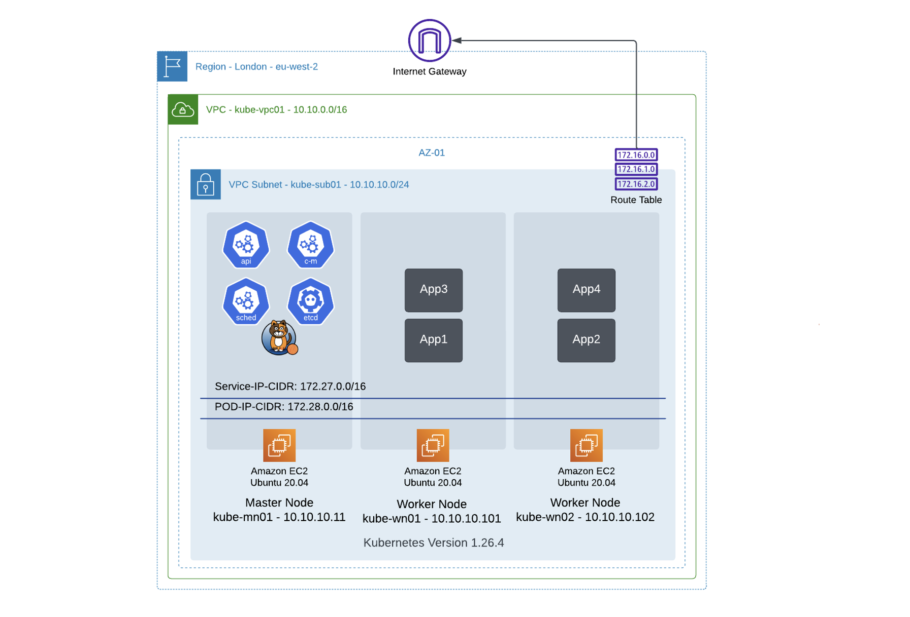
</p>

---

__Infrastructure Info:__

- 1 VPC                 - Name: kube-vpc01  - Network CIDR: 10.10.0.0/16
- 1 Public Subnet       - Name: kube-sub01  - Network CIDR: 10.10.10.0/24   -   Public IP Allowed
- 1 Internet Gateway    - Name: kube-igw01  - Attached to kube-vpc01
- 1 Routing Table       - Name: kube-rt01   - Attached to kube-vpc01 and associated to kube-sub01
- 1 Security Group      - Name: kube-sg01   - Attached to kube-vpc01 and associated to kube-sub01
- 3 EC2 Instances:      - Info in below table & all created in kube-sub01

| Name      | OS           | Private IP      | Public IP   |
|-----------|--------------|-----------------|-------------|
| kube-mn01 | Ubuntu 20.04 | 10.10.10.11/24  | 3.10.152.31 |
| kube-wn01 | Ubuntu 20.04 | 10.10.10.101/24 | 13.40.7.253 |
| kube-wn02 | Ubuntu 20.04 | 10.10.10.102/24 | 3.8.215.234 |

---
> Pre-Requisite
---

Before starting the installation and building the kubernetes cluster, some pre-requisite must be met first, please make sure:
- Using a supported linux/windows distribution for kubernetes. Check the kubernetes version [release](https://kubernetes.io/releases/)
- Sufficient Node resources - minimum of 2 GB Ram or more, minimum of 2 CPU or more.
- Full networking connectivity between all nodes (Master & Worker).
- Required networking ports to be opened. Please check this [link](https://kubernetes.io/docs/reference/networking/ports-and-protocols/) for a list of ports.
- Swap to be disabled.
- Configure hostname on all nodes.
- Ensure hosts file is updated with all FQDN and IP of all nodes in the cluster.

---

## Step-By-Step Guide Building a Kubernetes Cluster with Kubeadm


SSh to the Master Node. In this Guide, AWS EC2 instance are used, SSH to the EC2 instance using the configured Key-Pair.
Please Note: To SSH to the Master Node in this Guide, EC2 instance Public IP will be used, however, the rest of the guide will be using the Private IP address of the Nodes.

```bash
ssh -i "kube-demo-key-pairs.pem" ubuntu@3.10.152.31
```
---

<p align="center">
    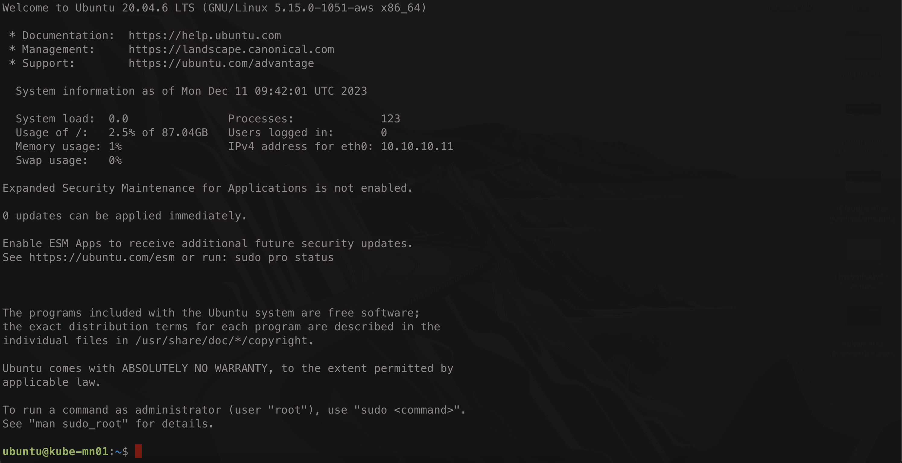
</p>

---

Now ensure hostname is configured and hosts file is updated properly. Also, ensure network connectivity with the required port are open.

---

<p align="center">
    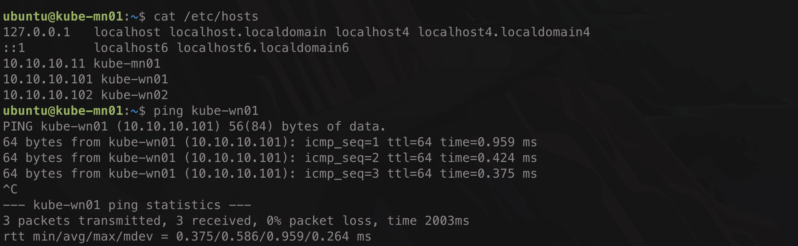
</p>

---
> __1. Install Container Runtime, Required Packages, and configure pre-requisites on Linux System (All Nodes)__
---

`Please Note: Perform the below action on All Nodes`

Kubeadm will install kubernetes components on containers, Container Runtime must be installed. `Containerd` is the Container Runtime used in this guide.

---
>> 1a. Disable Sawp 
---

```bash
sudo swapoff -a
```

<p align="center">
    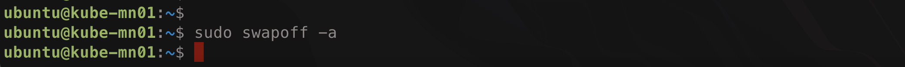
</p>

---
>> 1b. Add Overlay and net filters required in kubernetes config file 
---

```bash
# Add required modules:
cat <<EOF | sudo tee /etc/modules-load.d/k8s.conf
overlay
br_netfilter
EOF
```

<p align="center">
    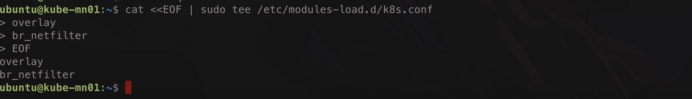
</p>

```bash
# Load modules:
sudo modprobe overlay
sudo modprobe br_netfilter
```

<p align="center">
    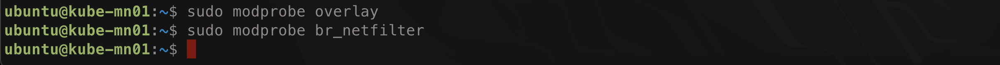
</p>

---
>> 1c. Configure IPv4 Forwarding and iptables to see bridged traffic in kubernetes config file
---

```bash
# Configure sysctl params:
cat <<EOF | sudo tee /etc/sysctl.d/k8s.conf
net.bridge.bridge-nf-call-iptables  = 1
net.bridge.bridge-nf-call-ip6tables = 1
net.ipv4.ip_forward                 = 1
EOF
```

<p align="center">
    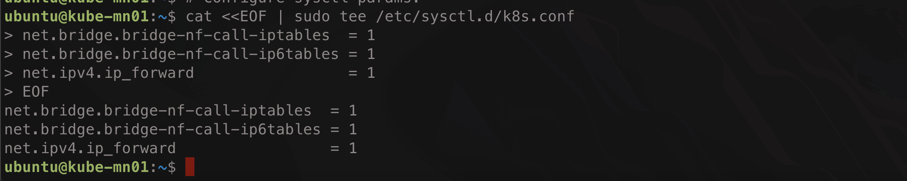
</p>

```bash
# Apply sysctl params without reboot:
sudo sysctl --system
```

<p align="center">
    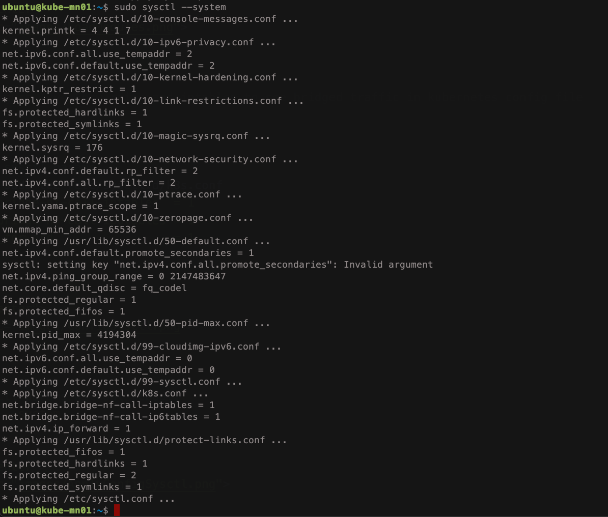
</p>

---
>> 1d. Install Container Runtime containerd and Docker Engine 
---

```bash
# Add Docker's official GPG key:
sudo apt-get update && sudo apt-get install ca-certificates curl gnupg apt-transport-https ipvsadm ipset watch tcpdump gpg
sudo install -m 0755 -d /etc/apt/keyrings
curl -fsSL https://download.docker.com/linux/ubuntu/gpg | sudo gpg --dearmor -o /etc/apt/keyrings/docker.gpg
sudo chmod a+r /etc/apt/keyrings/docker.gpg
```

<p align="center">
    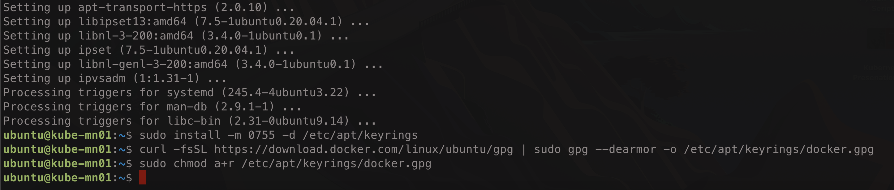
</p>

```bash
# Add the repository to Apt sources:
echo \
  "deb [arch=$(dpkg --print-architecture) signed-by=/etc/apt/keyrings/docker.gpg] https://download.docker.com/linux/ubuntu \
  $(. /etc/os-release && echo "$VERSION_CODENAME") stable" | \
  sudo tee /etc/apt/sources.list.d/docker.list > /dev/null
```

<p align="center">
    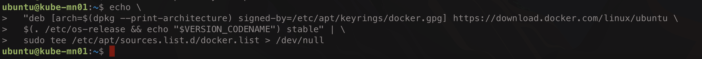
</p>

```bash
# Update repository and install containerd:
sudo apt-get update && sudo apt-get install -y containerd.io
```

<p align="center">
    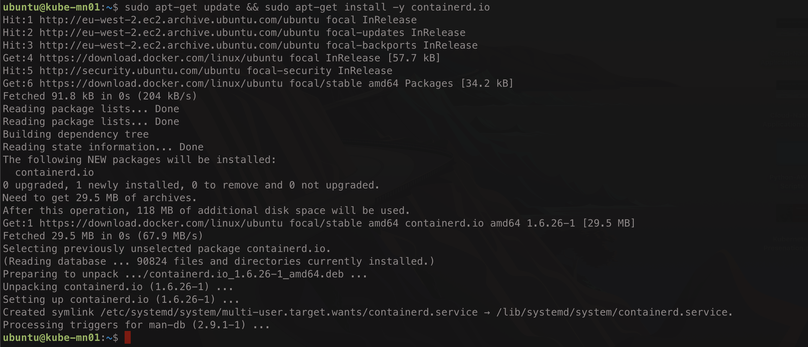
</p>

```bash
# Create containerd configuration file and comment out 'disabled_plugins' and change SystemCgroup to True
sudo mkdir -p /etc/containerd
containerd config default | sudo tee /etc/containerd/config.toml >/dev/null 2>&1
sudo sed -i 's/disabled_plugins/#disabled_plugins/' /etc/containerd/config.toml
sudo sed -i 's/SystemdCgroup \= false/SystemdCgroup \= true/g' /etc/containerd/config.toml
```

<p align="center">
    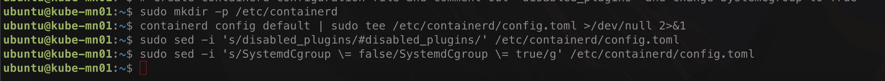
</p>

```bash
# restart and enable containerd service
sudo systemctl restart containerd && sudo systemctl enable containerd
```

<p align="center">
    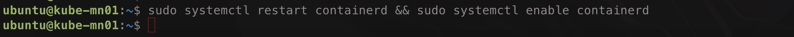
</p>

__Please Note: Perform/Repeat all the above actions on all nodes in the cluster__

---
> __2. Install Kubeadm, Kubelet, and Kubectl (All Nodes)__
---

`Please Note: Perform the below action on All Nodes`

Kubernetes Version used in this guide is version 1.26.4. If a different version is required, changes need to be made for the below commands. Version of Kubernetes to be installed must match the version of Kubeadm, Kubelet

---
>> 2a. Get and Add Google Package Repository Key and Add the appropriate Kubernetes apt repository
---

```bash
curl -s https://packages.cloud.google.com/apt/doc/apt-key.gpg | sudo apt-key add -
cat << EOF | sudo tee /etc/apt/sources.list.d/kubernetes.list
deb https://apt.kubernetes.io/ kubernetes-xenial main
EOF
```

---
>> 2b. Install Kubeadm, Kubelet, and Kubectl 
___


```bash
sudo apt-get update && sudo apt-get install -y kubelet=1.26.4-00 kubeadm=1.26.4-00 kubectl=1.26.4-00
```

```bash
# stop automatic update
sudo apt-mark hold kubelet kubeadm kubectl
```

__Please Note: Perform/Repeat all the above actions on all nodes in the cluster__

---
> __3. Initialize the Kubernetes Cluster and configure Kubectl (Master Node Only)__
---

`Please Note: Perform the below action on the Master Node Only`

Kubeadm will be used to initialize the kubernetes cluster and deploy all kubernetes components along with all required configuration to build the Control Plan of the kubernetes cluster

---
>> 3a. Initialize Kubeadm with required configuration 
---

```bash
sudo kubeadm init --pod-network-cidr 172.30.0.0/16  --service-cidr 172.29.0.0/16 --kubernetes-version 1.26.4
```

---
>> 3b. Configure kubectl
---

```bash
mkdir -p $HOME/.kube
sudo cp -i /etc/kubernetes/admin.conf $HOME/.kube/config
sudo chown $(id -u):$(id -g) $HOME/.kube/config
```

---
>> 3c. Install Calico CNI 
---

```bash
kubectl apply -f https://raw.githubusercontent.com/projectcalico/calico/v3.25.0/manifests/calico.yaml
```

---
>> 3d. Print the kubeadm join command
---

```bash
sudo kubeadm token create --print-join-command
```

__Please Note: Perform/Repeat all the above actions Only On Master Node__

---
> __4. Join all Worker Nodes to the Kubernetes Cluster__
---

`Please Note: Perform the below action on the Worker Nodes Only`

From the command used in step 3d, copy the output and past it on all worker nodes. Please use `sudo` with the command execution.


__Please Note: Perform/Repeat all the above actions Only On Worker Node__

---

#### References

- [[1] - Installing kubeadm](https://kubernetes.io/docs/setup/production-environment/tools/kubeadm/install-kubeadm/)
- [[2] - Installing containerd on Ubuntu](https://docs.docker.com/engine/install/ubuntu/)
- [[3] - Creating a cluster with kubeadm](https://kubernetes.io/docs/setup/production-environment/tools/kubeadm/create-cluster-kubeadm/)

---

> Next Step:

[Interacting with Kubernetes using kubectl](https://github.com/tahershaker/Learning-Kubernetes/tree/main/4.%20Interacting%20with%20Kubernetes%20using%20Kubectl)