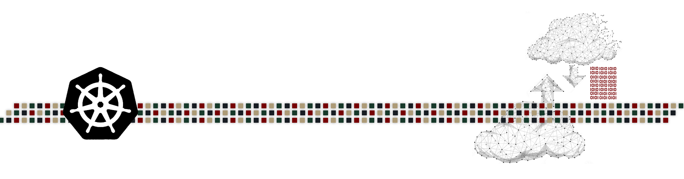
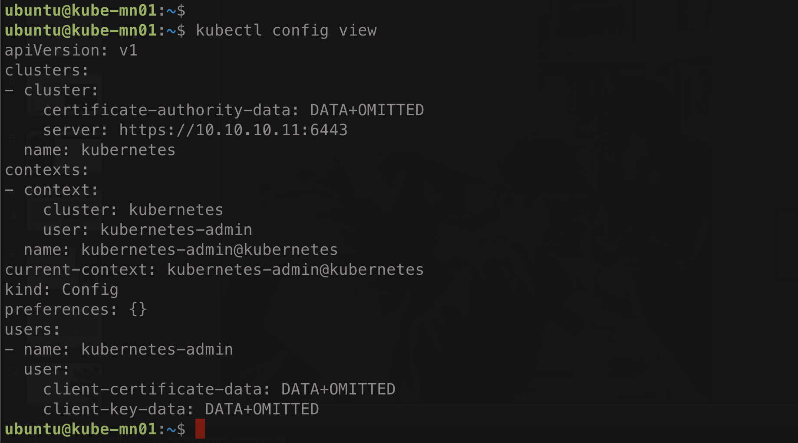
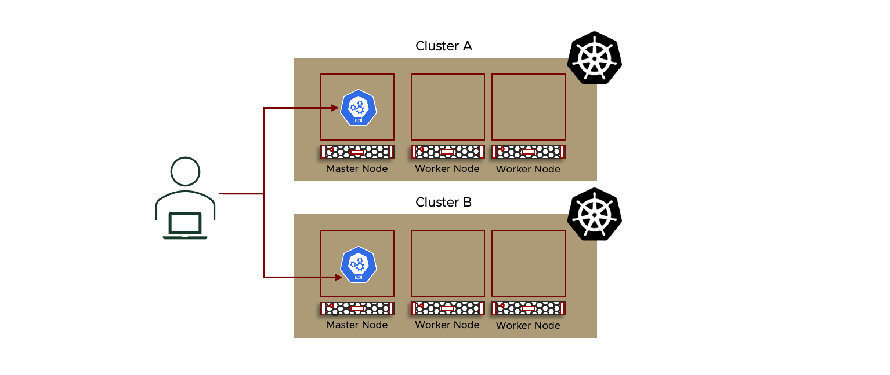
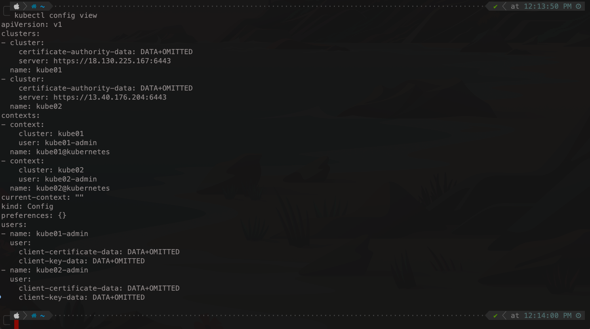
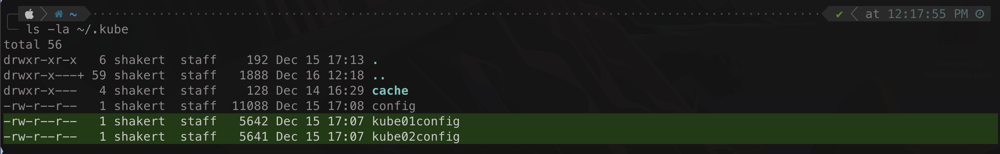

# Kubernetes Cluster & Object Management with Kubectl & YAML

User Interaction with a Kubernetes cluster to manage a kubernetes cluster or deploy object on the cluster is done through the communication with the [Kube-API-Server](https://github.com/tahershaker/Learning-Kubernetes/tree/main/2.%20Kubernetes%20Cluster%20Architecture%20-%20Components%20%26%20High-level%20Main%20Objects#3a-i-api-server) as explained in a previous section. The communication with the API server can be through a direct REST API call or through the CLI tool called `kubectl`. In most cases kubectl is the tool used to interact with a Kubernetes Cluster. To deploy an object on top of a Kubernetes Cluster, user define the object kind, specs, and desired state of this object in a manifest file in a `YAML` file format. JSON file can also be used but normally YAML files are most commonly used. Thus, managing a kubernetes cluster and objects are based on `kubectl` CLI tool and the `YAML` files.

---

<p align="center">
    
</p>

---

## Kubectl CLI Tool

User Interaction with a Kubernetes cluster to manage a kubernetes cluster or deploy object on the cluster is done through the communication with the [Kube-API-Server](https://github.com/tahershaker/Learning-Kubernetes/tree/main/2.%20Kubernetes%20Cluster%20Architecture%20-%20Components%20%26%20High-level%20Main%20Objects#3a-i-api-server) as explained in a previous section. The communication with the API server can be through a direct REST API call or through the CLI tool called `kubectl`. In most cases kubectl is the tool used to interact with a Kubernetes Cluster.

---

### What is Kubectl

Kubectl is a CLI tool for kubernetes used to interact with a kubernetes cluster through `kube-api-server`. Kubectl communicates with the kubernetes API Server and perform the required authentication and then sends API requests to perform the required action. With kubectl, a user can create, update, inspect, delete objects as well as accessing log file and even accessing the shell of the containers running inside the cluster. Kubectl is available to be installed on Linux, Windows, and MacOS. 

When you create a kubernetes cluster, by default, kubectl is also installed with it on the master node along with the required configuration to use kubectl with the cluster. kubectl can also be installed on an external location (ex: local machine) and then used to interact with one or more kubernetes cluster.

You can use kubectl against a kubernetes cluster in 3 different modes:
- __Imperative Commands:__ The user uses kubectl to directly perform an action such as creating a Pod or deleting s Deployment - `kubectl create <object>`
- __Imperative Object Configuration:__ The user uses kubectl along with a manifest file (the `YAML` file) to create or delete an object with the info provided in the YAML file - `kubectl create -f <file-name.yaml>`
- __Declarative Object Configuration:__ The user uses kubectl along with a manifest file (the `YAML` file) to create (if not exists) or update (if exists) an object with the info provided in the YAML file - `kubectl apply -f <file-name.yaml>`

> _Reference_
> - _Kubernetes provides a command line tool for communicating with a Kubernetes cluster's control plane, using the Kubernetes API. This tool is named kubectl._<sup>Reference [1](#References)</sup>
> - _The Kubernetes command-line tool, kubectl, allows you to run commands against Kubernetes clusters. You can use kubectl to deploy applications, inspect and manage cluster resources, and view logs._<sup>Reference [2](#References)</sup>
> - _The kubectl tool supports three kinds of object management:_<sup>Reference [5](#References)</sup>
>>  - _Imperative commands_
>>  - _Imperative object configuration_
>>  - _Declarative object configuration_

---

### Kubectl Configuration (kubeconfig) File

For a user to access a kubernetes cluster and authenticate with it using kubectl, some information are required such as the IP/FQDN of the API server, user credentials and more. By default, kubectl reads all of these info from a file called `kubeconfi`, and by default, this file is located at `$HOME/.kube/` directory. A `Kubeconfig` is a YAML file with all the Kubernetes cluster details, certificates, and secret tokens required to connect and authenticate with the kubernetes cluster.By default, kubectl will look for the kubeconfig file locates at `$HOME/.kube/` and uses the information in the file to connect to the kubernetes cluster API. This behaviour is the default either the user is directly connected to the master node through SSH and using kubectl installed on the master node or using kubectl install remotely on a local or remote machine.

By default when installing kubernetes using kubeadm as listed in a [previous section](https://github.com/tahershaker/Learning-Kubernetes/tree/main/3.%20Building%20A%20Kubernetes%20Cluster/Building%20A%20Kubernetes%20Cluster%20with%20kubeadm), the kubeconfig file is created in the default location `$HOME/.kube/`. If the previous section mentioned is reviewed, during the installation process, the below command was executed which created and configured the  kubeconfig file.

```bash
mkdir -p $HOME/.kube
sudo cp -i /etc/kubernetes/admin.conf $HOME/.kube/config
sudo chown $(id -u):$(id -g) $HOME/.kube/config
```

The kubeconfig file will hold the following key information that are used to connect and authenticate with the kubernetes cluster:
- __Cluster:__ 
  - _certificate-authority-data:_ - This is the Cluster CA Certificate
  - _Server:_ - This is the API Server IP/FQDN
  - _Name:_ - This is the name of the cluster
- __User:__ 
  - _Name:_ - This is the name of the User
  - _Credentials:_ - This is the credentials used by the user. Could be certificate, Token, Username and Password, etc...
- __Context:__
  - The context is used to map the cluster to the appropriate user as there could be multiple clusters and multiple users
  - _Cluster:_ - This is the cluster used for this context
  - _User:_ - This is the user mapped to the cluster for this context
  - _Name:_ - This is the name of the context

Below is an example of a kubeconfig YAML file

---

```yaml
apiVersion: v1
clusters:
- cluster:
    certificate-authority-data: DATA+OMITTED
    server: https://10.10.10.11:6443
  name: kubernetes
contexts:
- context:
    cluster: kubernetes
    user: kubernetes-admin
  name: kubernetes-admin@kubernetes
current-context: kubernetes-admin@kubernetes
kind: Config
preferences: {}
users:
- name: kubernetes-admin
  user:
    client-certificate-data: DATA+OMITTED
    client-key-data: DATA+OMITTED
```

---

To view the content of the kubeconfig file, use the below command

```bash
kubectl config view
```

---

<p align="center">
    
</p>

---

> _Reference_
> - _By default, kubectl looks for a file named config in the $HOME/.kube directory. You can specify other kubeconfig files by setting the KUBECONFIG environment variable or by setting the --kubeconfig flag._<sup>Reference [9](#References)</sup>

---

### Using interaction with multiple kubernetes cluster

`Please Note: Cluster Authentication will be discussed in a later section`

In most cases, users will be interacting with multiple kubernetes cluster, example, a user can be interacting with a production cluster, a development cluster and a testing cluster, in this example the user will be interacting with 3 different cluster. 

---
<p align="center">
    
</p>
---

As mentioned above, kubectl will, by default, look for the kubeconfig file located at `$HOME/.kube/` directory to get all required information to connect and authenticate with a kubernetes cluster at a given time. The user will have kubectl installed on a local machine and using it to interact with more than one different clusters. The admin of the kubernetes cluster will be generating user access and providing these access to the user where the user will be adding these info to the kubeconfig file to be able to use it and authenticating and interacting with these different cluster. The main question is how wil the user interact with the different clusters where each have a different IP for the API server and a different access credentials or even, in some cases, different access methods and credentials type. 

A user can use the Kubeconfig in different methods to switch from one cluster to another and kubectl uses these methods in a priority order. These methods are:

- _Kubectl Context:_ Using the kubectl, a user can chose a context from what is configured in the Kubeconfig file and each context points to a different cluster. Kubectl context has the highest priority.
- _KUBECONFIGEnvironment Variable:_ This environment variable should, by default, point to the default kubeconfig file, however, when set, it can point to a different configuration file(s) to be used while using the kubectl CLI Tool. KUBECONFIG env variable overrides the current context in the default kubeconfig file.
- _Command-Line Reference:_ Using the kubectl CLI tool, a user can specify a different kubeconfig file using the command line option `--kubeconfig` in the syntax. The `--kubeconfig` command line option has the highest priority; all other Kubeconfigs are ignored. 


> _Reference_
> - _Use kubeconfig files to organize information about clusters, users, namespaces, and authentication mechanisms. The kubectl command-line tool uses kubeconfig files to find the information it needs to choose a cluster and communicate with the API server of a cluster._<sup>Reference [9](#References)</sup>
> _By default, kubectl looks for a file named config in the $HOME/.kube directory. You can specify other kubeconfig files by setting the KUBECONFIG environment variable or by setting the --kubeconfig flag._<sup>Reference [9](#References)</sup>

Taking an example and looking into the 3 mentioned methods. In the example, there are 2 kubernetes cluster and a remote local machine using kubectl to access the 2 clusters. All information regarding the access to the cluster are added to the remote local machine into the default kubeconfig file. Each kubernetes cluster have 3 nods (1 Master and 2 Workers). The first cluster have the prefix of kube- and the second cluster have the prefix of kube02-. Also there are 2 other kubeconfig file located in a non-default location each is for accessing each cluster.

```bash
kubectl config view
```

---

<p align="center">
    
</p>

---

```bash
ls -la ~/.kube
```

---

<p align="center">
    
</p>

---

### Using Kubeconfig Context


---


#### KUBECONFIG environment variable

By default the kubectl will look for the kubeconfig file locates at `$HOME/.kube/`. A user can use the KUBECONFIG environment variable

One way is setting a KUBECONFIG environment variable on the local machine which will hold info to access one of the clusters and when required to interact with a different cluster, re-set the KUBECONFIG environment variable. This is not a recommended way of achieving this action but it is an option.


---

### kubectl Contexts


---


#### References

- [[1] - Kubernetes Command Line Tool Kubectl](https://kubernetes.io/docs/reference/kubectl/)
- [[2] - Kubernetes Install Tools](https://kubernetes.io/docs/tasks/tools/)
- [[3] - Install and Set Up kubectl on Linux](https://kubernetes.io/docs/tasks/tools/install-kubectl-linux/)
- [[4] - Manage Kubernetes Objects](https://kubernetes.io/docs/tasks/manage-kubernetes-objects/)
- [[5] - Declarative Management of Kubernetes Objects Using Configuration Files](https://kubernetes.io/docs/tasks/manage-kubernetes-objects/declarative-config/)
- [[6] - Managing Kubernetes Objects Using Imperative Commands](https://kubernetes.io/docs/tasks/manage-kubernetes-objects/imperative-command/)
- [[7] - Imperative Management of Kubernetes Objects Using Configuration Files](https://kubernetes.io/docs/tasks/manage-kubernetes-objects/imperative-config/)
- [[8] - Configure Access to Multiple Clusters](https://kubernetes.io/docs/tasks/access-application-cluster/configure-access-multiple-clusters/)
- [[9] - Organizing Cluster Access Using kubeconfig Files](https://kubernetes.io/docs/concepts/configuration/organize-cluster-access-kubeconfig/)


---

> Next Step:

[Kubernetes Containerized Workloads - Containers, Pods, ReplicaSet, & Deployments](https://github.com/tahershaker/Learning-Kubernetes/tree/main/5.%20Kubernetes%20Containerized%20Workloads%20-%20Pods%20%26%20Deployments)