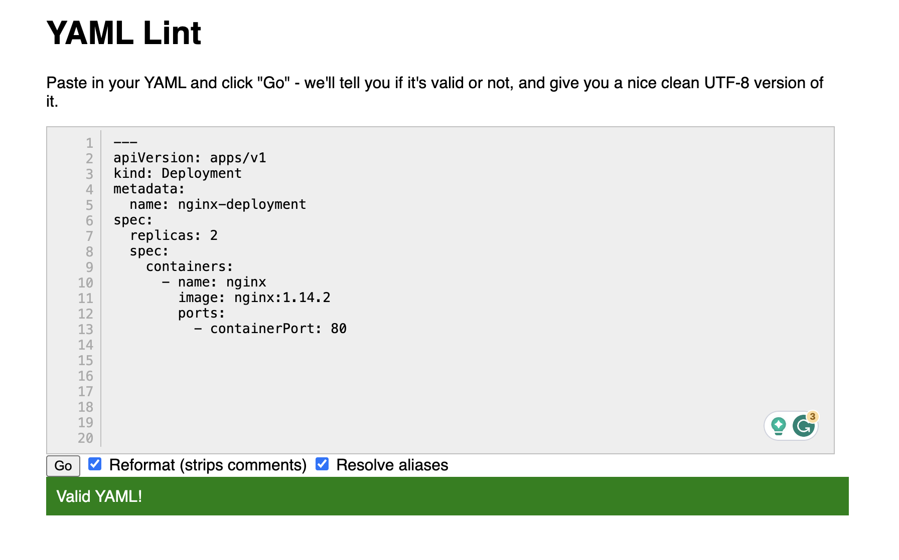
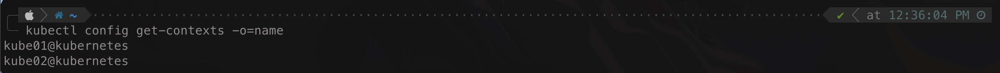
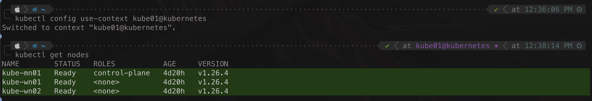
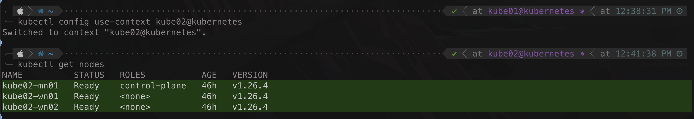
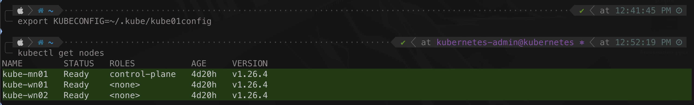
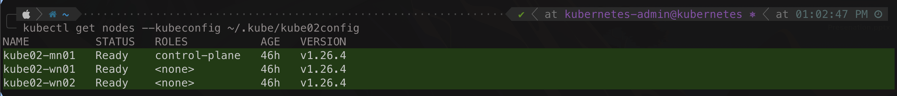

# Kubernetes Cluster & Object Management with Kubectl & YAML

User Interaction with a Kubernetes cluster to manage a kubernetes cluster or deploy object on the cluster is done through the communication with the [Kube-API-Server](https://github.com/tahershaker/Learning-Kubernetes/tree/main/2.%20Kubernetes%20Cluster%20Architecture%20-%20Components%20%26%20High-level%20Main%20Objects#3a-i-api-server) as explained in a previous section. The communication with the API server can be through a direct REST API call or through the CLI tool called `kubectl`. In most cases kubectl is the tool used to interact with a Kubernetes Cluster. To deploy an object on top of a Kubernetes Cluster, user define the object kind, specs, and desired state of this object in a manifest file in a `YAML` file format. JSON file can also be used but normally YAML files are most commonly used. Thus, managing a kubernetes cluster and objects are based on `kubectl` CLI tool and the `YAML` files.

---

<p align="center">
    
</p>

---

## YAML File

When interacting with a Kubernetes cluster, the user, in most cases if not all, uses a CLI tool called kubectl. To create an object in Kubernetes, the user must define the kind, specs, and desired state of this object. 

All of this information are defined in a manifest file. Normally this is done using a `YAML` formate file - `PS: JSON file can also be used but normally YAML files are most commonly used`. The user create the YAML file and defined all of these information inside this file and then create the object on the kubernetes cluster using this file. 

Once the Manifest YAML file is sent to the kubernetes cluster, kubernetes will work on creating, Deploying, monitoring, and maintaining this object on the kubernetes cluster.

> _Reference_
> - _A Kubernetes object is a `"record of intent"` --once you create the object, the Kubernetes system will constantly work to ensure that object exists. By creating an object, you're effectively telling the Kubernetes system what you want your cluster's workload to look like; this is your cluster's `desired state`._<sup>Reference [1](#References)</sup>
> - _Almost every Kubernetes object includes two nested object fields that govern the object's configuration: the object spec and the object status. For objects that have a spec, you have to set this when you create the object, providing a description of the characteristics you want the resource to have: its `desired state`._<sup>Reference [1](#References)</sup>
> - _The status describes the current state of the object, supplied and updated by the Kubernetes system and its components. The Kubernetes control plane continually and actively manages every object's `actual state` to match the `desired state` you supplied._<sup>Reference [1](#References)</sup>
> - _When you create an object in Kubernetes, you must provide the object spec that describes its desired state, as well as some basic information about the object (such as a name). When you use the Kubernetes API to create the object (either directly or via kubectl), that API request must include that information as JSON in the request body. Most often, you provide the information to kubectl in file known as a `manifest`. By convention, manifests are YAML (you could also use JSON format). Tools such as kubectl convert the information from a manifest into JSON or another supported serialization format when making the API request over HTTP._<sup>Reference [2](#References)</sup>

As a summary, once the kubernetes cluster is created, the user starts creating object `manifest` in the form of a `YAML` file which it will hold the object `spec` and the object `desired state` and then pass it to kubernetes using the CLI kubectl tool or directly using an API request. Kubernetes will make sure that this object is created based on the provided object spec and insure that the actual state of this object always match the defined desired state of this object.

When creating the manifest YAML file, some key elements must be set in the YAML file, these elements are:
- API Version: setting the version of API for kubernetes to understand the API formatting and features to be used.
- Kind: The kind or type of object this file will create.
- Metadata: Some metadata info of the object can be specified in this element such as object labels, name, etc...
- Spec: The specifications of this Object.

The formate of a YAML file with the above mentioned elements are:

```yaml
apiVersion: apps/v1 # API version number
kind: Deployment # Object type
metadata: # Additional info to be added to the object
  name: nginx-deployment # Name of the Object
spec: # Specs of the object
  replicas: 2 # Specify that 2 Pods to be deployed form the same replica
  spec: # Specs of the Container
    containers:
    - name: nginx # Container Name
      image: nginx:1.14.2 # Container Image
      ports: # Container Networking
      - containerPort: 80
```

To Check the formatting of the YAML file, use this [Link](https://www.yamllint.com/)

---

<p align="center">
    
</p>

---

## Kubectl CLI Tool

User Interaction with a Kubernetes cluster to manage a kubernetes cluster or deploy object on the cluster is done through the communication with the [Kube-API-Server](https://github.com/tahershaker/Learning-Kubernetes/tree/main/2.%20Kubernetes%20Cluster%20Architecture%20-%20Components%20%26%20High-level%20Main%20Objects#3a-i-api-server) as explained in a previous section. The communication with the API server can be through a direct REST API call or through the CLI tool called `kubectl`. In most cases kubectl is the tool used to interact with a Kubernetes Cluster.

---

### What is Kubectl

Kubectl is a CLI tool for kubernetes used to interact with a kubernetes cluster through `kube-api-server`. Kubectl communicates with the kubernetes API Server and perform the required authentication and then sends API requests to perform the required action. With kubectl, a user can create, update, inspect, delete objects as well as accessing log file and even accessing the shell of the containers running inside the cluster. Kubectl is available to be installed on Linux, Windows, and MacOS. 

When you create a kubernetes cluster, by default, kubectl is also installed with it on the master node along with the required configuration to use kubectl with the cluster. kubectl can also be installed on an external location (ex: local machine) and then used to interact with one or more kubernetes cluster.

You can use kubectl against a kubernetes cluster in 3 different modes:
- __Imperative Commands:__ The user uses kubectl to directly perform an action such as creating a Pod or deleting s Deployment - `kubectl create <object>`
- __Imperative Object Configuration:__ The user uses kubectl along with a manifest file (the `YAML` file) to create or delete an object with the info provided in the YAML file - `kubectl create -f <file-name.yaml>`
- __Declarative Object Configuration:__ The user uses kubectl along with a manifest file (the `YAML` file) to create (if not exists) or update (if exists) an object with the info provided in the YAML file - `kubectl apply -f <file-name.yaml>`

> _Reference_
> - _Kubernetes provides a command line tool for communicating with a Kubernetes cluster's control plane, using the Kubernetes API. This tool is named kubectl._<sup>Reference [2](#References)</sup>
> - _The Kubernetes command-line tool, kubectl, allows you to run commands against Kubernetes clusters. You can use kubectl to deploy applications, inspect and manage cluster resources, and view logs._<sup>Reference [3](#References)</sup>
> - _The kubectl tool supports three kinds of object management:_<sup>Reference [6](#References)</sup>
>>  - _Imperative commands_
>>  - _Imperative object configuration_
>>  - _Declarative object configuration_

---

### Kubectl Syntax

To use the kubectl CLI tool, like any other CLI tool, kubectl have a syntax to be used wit the tool. Kubectl syntax is as follow:

`kubectl [command] [type] [name] [flag]`

- Command: Specify what type of operation required, ex: create, apply, delete, get, etc...
- Type: Specify the type of resources to apply the operation on, ex: pod, service, deployment, etc...
- Name: The name of the resources type 
- Flag: This is optional, use flag to add more specific operation, ex: --namespace - this flag can be set to identify a specific namespace to execute the operation on it.

To change the output format of the command execution, use the `-o`, ex: -o yaml, -o name, -o wide.

To use the object configuration object using a file, use the `-f <file-name.yaml>`

> Examples:

- Get Pod with the name frontend form the namespace development and set the output to be in JSON format

```bash
kubectl get pod frontend --namespace development -o json
```

- Create a pod with a configuration file called nginx-frontend.yaml in the namespace production

```bash
kubectl create pod -f nginx-frontend.yaml --namespace production
```

For the list of all commands, flags, and options, please refer to the kubernetes documentation in this [link](https://kubernetes.io/docs/reference/kubectl/)

---

### Kubectl Configuration (kubeconfig) File

For a user to access a kubernetes cluster and authenticate with it using kubectl, some information are required such as the IP/FQDN of the API server, user credentials and more. By default, kubectl reads all of these info from a file called `kubeconfi`, and by default, this file is located at `$HOME/.kube/` directory. A `Kubeconfig` is a YAML file with all the Kubernetes cluster details, certificates, and secret tokens required to connect and authenticate with the kubernetes cluster.By default, kubectl will look for the kubeconfig file locates at `$HOME/.kube/` and uses the information in the file to connect to the kubernetes cluster API. This behaviour is the default either the user is directly connected to the master node through SSH and using kubectl installed on the master node or using kubectl install remotely on a local or remote machine.

By default when installing kubernetes using kubeadm as listed in a [previous section](https://github.com/tahershaker/Learning-Kubernetes/tree/main/3.%20Building%20A%20Kubernetes%20Cluster/Building%20A%20Kubernetes%20Cluster%20with%20kubeadm), the kubeconfig file is created in the default location `$HOME/.kube/`. If the previous section mentioned is reviewed, during the installation process, the below command was executed which created and configured the  kubeconfig file.

```bash
mkdir -p $HOME/.kube
sudo cp -i /etc/kubernetes/admin.conf $HOME/.kube/config
sudo chown $(id -u):$(id -g) $HOME/.kube/config
```

The kubeconfig file will hold the following key information that are used to connect and authenticate with the kubernetes cluster:
- __Cluster:__ 
  - _certificate-authority-data:_ - This is the Cluster CA Certificate
  - _Server:_ - This is the API Server IP/FQDN
  - _Name:_ - This is the name of the cluster
- __User:__ 
  - _Name:_ - This is the name of the User
  - _Credentials:_ - This is the credentials used by the user. Could be certificate, Token, Username and Password, etc...
- __Context:__
  - The context is used to map the cluster to the appropriate user as there could be multiple clusters and multiple users
  - _Cluster:_ - This is the cluster used for this context
  - _User:_ - This is the user mapped to the cluster for this context
  - _Name:_ - This is the name of the context

Below is an example of a kubeconfig YAML file

---

```yaml
apiVersion: v1
clusters:
- cluster:
    certificate-authority-data: DATA+OMITTED
    server: https://10.10.10.11:6443
  name: kubernetes
contexts:
- context:
    cluster: kubernetes
    user: kubernetes-admin
  name: kubernetes-admin@kubernetes
current-context: kubernetes-admin@kubernetes
kind: Config
preferences: {}
users:
- name: kubernetes-admin
  user:
    client-certificate-data: DATA+OMITTED
    client-key-data: DATA+OMITTED
```

---

To view the content of the kubeconfig file, use the below command

```bash
kubectl config view
```

---

<p align="center">
    
</p>

---

> _Reference_
> - _By default, kubectl looks for a file named config in the $HOME/.kube directory. You can specify other kubeconfig files by setting the KUBECONFIG environment variable or by setting the --kubeconfig flag._<sup>Reference [10](#References)</sup>

---

### Multiple kubernetes cluster Management

`Please Note: Cluster Authentication will be discussed in a later section`

In most cases, users will be interacting with multiple kubernetes cluster, example, a user can be interacting with a production cluster, a development cluster and a testing cluster, in this example the user will be interacting with 3 different cluster. 

---

<p align="center">
    
</p>

---

As mentioned above, kubectl will, by default, look for the kubeconfig file located at `$HOME/.kube/` directory to get all required information to connect and authenticate with a kubernetes cluster at a given time. The user will have kubectl installed on a local machine and using it to interact with more than one different clusters. The admin of the kubernetes cluster will be generating user access and providing these access to the user where the user will be adding these info to the kubeconfig file to be able to use it and authenticating and interacting with these different cluster. The main question is how wil the user interact with the different clusters where each have a different IP for the API server and a different access credentials or even, in some cases, different access methods and credentials type. 

A user can use the Kubeconfig in different methods to switch from one cluster to another and kubectl uses these methods in a priority order. These methods are:

- _Kubectl Context:_ Using the kubectl, a user can chose a context from what is configured in the Kubeconfig file and each context points to a different cluster. Kubectl context has the highest priority.
- _KUBECONFIG Environment Variable:_ This environment variable should, by default, point to the default kubeconfig file, however, when set, it can point to a different configuration file(s) to be used while using the kubectl CLI Tool. KUBECONFIG env variable overrides the current context in the default kubeconfig file.
- _Command-Line Reference:_ Using the kubectl CLI tool, a user can specify a different kubeconfig file using the command line option `--kubeconfig` in the syntax. The `--kubeconfig` command line option has the highest priority; all other Kubeconfigs are ignored. 


> _Reference_
> - _Use kubeconfig files to organize information about clusters, users, namespaces, and authentication mechanisms. The kubectl command-line tool uses kubeconfig files to find the information it needs to choose a cluster and communicate with the API server of a cluster._<sup>Reference [10](#References)</sup>
> _By default, kubectl looks for a file named config in the $HOME/.kube directory. You can specify other kubeconfig files by setting the KUBECONFIG environment variable or by setting the --kubeconfig flag._<sup>Reference [10](#References)</sup>

Taking an example and looking into the 3 mentioned methods. In the example, there are 2 kubernetes cluster and a remote local machine using kubectl to access the 2 clusters. All information regarding the access to the cluster are added to the remote local machine into the default kubeconfig file. Each kubernetes cluster have 3 nods (1 Master and 2 Workers). The first cluster have the prefix of kube- and the second cluster have the prefix of kube02-. Also there are 2 other kubeconfig file located in a non-default location each is for accessing each cluster.

```bash
kubectl config view
```

---

<p align="center">
    
</p>

---

```bash
ls -la ~/.kube
```

---

<p align="center">
    
</p>

---

#### Using Kubeconfig Context

Context is an element in the kubeconfig file that group and map cluster information with the user access information. As mentioned above a kubeconfig file will have 3 main key elements, Cluster, User, and Context. IF the kubeconfig file have multiple clusters and user info, a user can use the context to switch from one cluster to another.

> _Reference_
> - _A context element in a kubeconfig file is used to group access parameters under a convenient name. Each context has three parameters: cluster, namespace, and user. By default, the kubectl command-line tool uses parameters from the current context to communicate with the cluster._<sup>Reference [10](#References)</sup>

To check the number of contexts, use:

```bash
kubectl config get-contexts -o=name
```

---

<p align="center">
    
</p>

---

To change from one cluster to another, set the context to the required cluster using the command `kubectl config use-context <cluster-name>`

```bash
kubectl config use-context kube01@kubernetes
```
```bash
kubectl get nodes
```
---

<p align="center">
    
</p>

---

From the above output, the list of kubernetes nodes are from kubernetes cluster 1, switch to the other context and get the nodes again to see it will change to the second kubernetes cluster nodes

```bash
kubectl config use-context kube02@kubernetes
```
```bash
kubectl get nodes
```
---

<p align="center">
    
</p>

---

#### Using KUBECONFIG environment variable

The KUBECONFIG environment variable is a variable that hold the location of the kubeconfig file(s). If the KUBECONFIG env variable is set it overrides the default kubeconfig file location, thus, KUBECONFIG env variable is not a requirement to use the kubectl tool. By default the kubectl will look for the kubeconfig file locates at `$HOME/.kube/`. A user can use the KUBECONFIG environment variable to point to a different configuration file(s) to be used while using the kubectl CLI Tool. To set the KUBECONFIG env variable use the command `export KUBECONFIG=<file-location>`

> _Reference_
> - _The KUBECONFIG environment variable holds a list of kubeconfig files. For Linux and Mac, the list is colon-delimited. For Windows, the list is semicolon-delimited. The KUBECONFIG environment variable is not required. If the KUBECONFIG environment variable doesn't exist, kubectl uses the default kubeconfig file, $HOME/.kube/config._<sup>Reference [10](#References)</sup>
> - _If the KUBECONFIG environment variable does exist, kubectl uses an effective configuration that is the result of merging the files listed in the KUBECONFIG environment variable._<sup>Reference [10](#References)</sup>

Currently, using the section example, the context is set to the second kubernetes cluster. Configure KUBECONFIG env variable and set it to a different kubeconfig file (kube01config) which is used to access the first kubernetes cluster to test the functionality as well as the priority. If the KUBECONFIG env variable is set and pointing to a different config file, it will override the default kubeconfig file. after setting the KUBECONFIG to the config file called kube01config in the example, the output should be the nodes for the first cluster not the second cluster.

```bash
export KUBECONFIG=~/.kube/kube01config
```
```bash
kubectl get nodes
```

---

<p align="center">
    
</p>

---

#### Using the --kubeconfig flag command line

The kubectl CLI tool provide the ability to specify a different kubeconfig file other than the default by using the flag `--kubeconfig <path-to-other-file>`. This option have the highest priority. Regardless of the context set or the KUBECONFIG env variable, if the --kubeconfig flag is used, it will override any other and the file passed with the flag is the one to be used.

To test this through the example, from the previous task, KUBECONFIG env variable is set to a non-default kubeconfig file (kube01config) and this is the one used now. Use the `kubectl get nodes` command with the file kube02config which points to the second cluster. The output should be the nodes for the second cluster not the first cluster.

```bash
kubectl get nodes --kubeconfig ~/.kube/kube02config
```

---

<p align="center">
    
</p>

---


---


#### References

- [[1] - Objects In Kubernetes](https://kubernetes.io/docs/concepts/overview/working-with-objects/)
- [[2] - Kubernetes Command Line Tool Kubectl](https://kubernetes.io/docs/reference/kubectl/)
- [[3] - Kubernetes Install Tools](https://kubernetes.io/docs/tasks/tools/)
- [[4] - Install and Set Up kubectl on Linux](https://kubernetes.io/docs/tasks/tools/install-kubectl-linux/)
- [[5] - Manage Kubernetes Objects](https://kubernetes.io/docs/tasks/manage-kubernetes-objects/)
- [[6] - Declarative Management of Kubernetes Objects Using Configuration Files](https://kubernetes.io/docs/tasks/manage-kubernetes-objects/declarative-config/)
- [[7] - Managing Kubernetes Objects Using Imperative Commands](https://kubernetes.io/docs/tasks/manage-kubernetes-objects/imperative-command/)
- [[8] - Imperative Management of Kubernetes Objects Using Configuration Files](https://kubernetes.io/docs/tasks/manage-kubernetes-objects/imperative-config/)
- [[9] - Configure Access to Multiple Clusters](https://kubernetes.io/docs/tasks/access-application-cluster/configure-access-multiple-clusters/)
- [[10] - Organizing Cluster Access Using kubeconfig Files](https://kubernetes.io/docs/concepts/configuration/organize-cluster-access-kubeconfig/)


---

> Next Step:

[Kubernetes Containerized Workloads - Containers, Pods, ReplicaSet, & Deployments](https://github.com/tahershaker/Learning-Kubernetes/tree/main/5.%20Kubernetes%20Containerized%20Workloads%20-%20Pods%20%26%20Deployments)