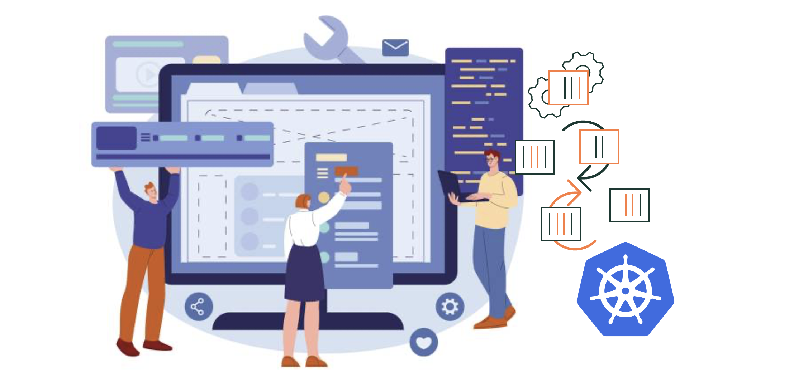

# Introduction to Kubernetes - Basic Concept

Kubernetes is a basic building block of the modern application development that is based on DevOps and Cloud-Native Architecture. Moving from a traditional 'Monolithic' application development into a microservices application development utilizing containers technology is becoming the norm and has been for a while. However, when the number of containers that are hosting your application grow in number to 100's or 1000's or even more, then managing, orchestrating, and automating these containers and their operation tasks is going to be road blocker. This is where Kubernetes comes in the picture.

---

    

---

> What is Kubernetes - Overview

Kubernetes is an open-source project build originally by Google in 2014 designed to orchestrate, automate and manage containerized applications. The official description of kubernetes from the official kubernetes documentation is:

'''
__Kubernetes is a portable, extensible, open source platform for managing containerized workloads and services, that facilitates both declarative configuration and automation. It has a large, rapidly growing ecosystem. Kubernetes services, support, and tools are widely available.__
'''

---

> References:

- [Kubernetes Overview - official Document](https://kubernetes.io/docs/concepts/overview/)
